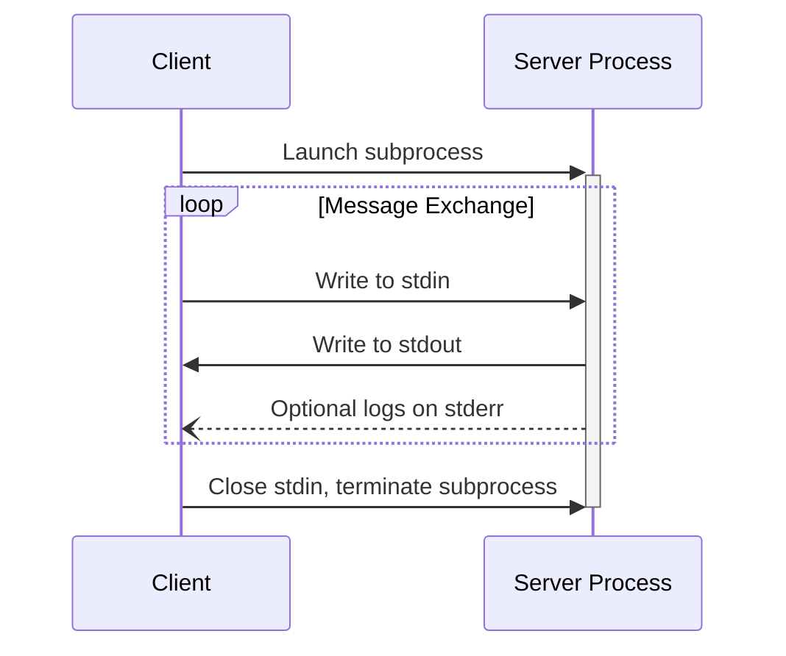
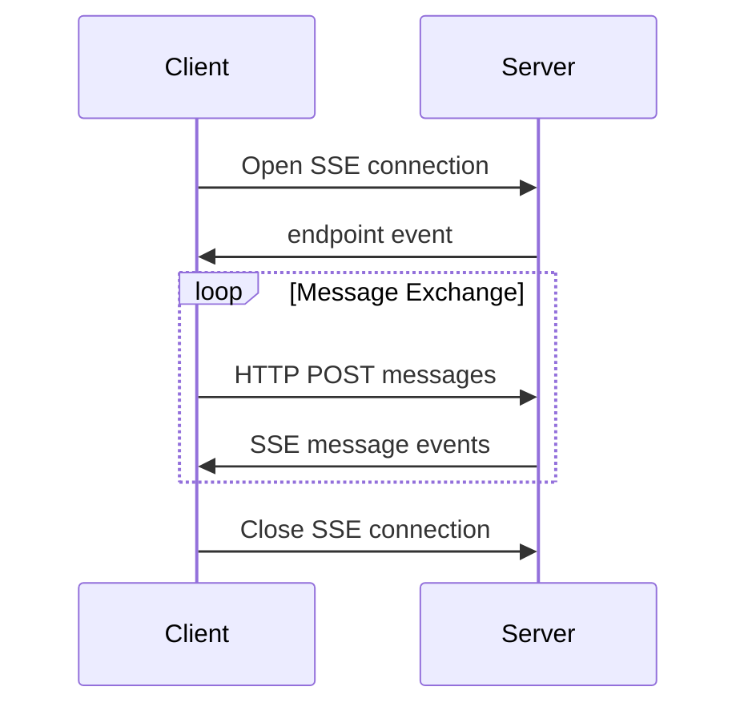

<Info>**协议修订**：2024-11-05</Info>

MCP 目前为客户端与服务器之间的通信定义了两种标准传输机制：

1. [stdio](#stdio)，通过标准输入和标准输出进行通信
2. [HTTP with Server-Sent Events](#http-with-sse)（SSE）

客户端在可行时**应当（SHOULD）**支持 stdio。

客户端和服务器也可以以可插拔的方式实现
[自定义传输方式](#custom-transports)。

  ## stdio

在 **stdio** 传输方式中：

- 客户端将 MCP 服务器作为子进程启动。
- 服务器从其标准输入（`stdin`）接收 JSON-RPC 消息，并将响应写入标准输出（`stdout`）。
- 消息以换行符分隔，且**不得**包含嵌入的换行符。
- 出于日志记录目的，服务器**可以**将 UTF-8 字符串写入标准错误（`stderr`）。客户端**可以**捕获、转发或忽略这些日志。
- 服务器**不得**向其 `stdout` 写入任何非有效的 MCP 消息。
- 客户端**不得**向服务器的 `stdin` 写入任何非有效的 MCP 消息。

  ## 使用 HTTP 与 SSE

在 **SSE** 传输方式中，服务器作为独立的进程运行，能够处理多个客户端连接。

  #### 安全警告

在实现使用 服务器发送事件（SSE） 的 HTTP 传输时：

1. 服务器**必须**在所有入站连接上验证 `Origin` 头，以防止 DNS 重绑定攻击
2. 在本地运行时，服务器**应当**只绑定到 localhost（127.0.0.1），而非所有网络接口（0.0.0.0）
3. 服务器**应当**为所有连接实施适当的身份验证

缺少这些防护时，攻击者可能利用 DNS 重绑定，从远程网站与本地 MCP 服务器进行交互。

服务器**必须**提供两个端点：

1. 一个 SSE 端点，供客户端建立连接并从服务器接收消息
2. 一个常规的 HTTP POST 端点，供客户端向服务器发送消息

当客户端连接时，服务器**必须**发送一个 `endpoint` 事件，包含客户端用于发送消息的 URI。此后所有客户端消息**必须**作为 HTTP POST 请求发送至该端点。

服务器消息以 SSE 的 `message` 事件发送，消息内容以 JSON 编码在事件数据中。

  ## 自定义传输方式

客户端和服务器**可以（MAY）**实现额外的自定义传输机制，以满足其特定需求。该协议与传输无关，可在任何支持双向消息交换的通信通道上实现。

选择支持自定义传输方式的实现者**必须（MUST）**确保保留由 MCP 定义的 JSON-RPC 消息格式和生命周期要求。自定义传输方式**应（SHOULD）**记录其特定的连接建立和消息交换模式，以促进互操作性。