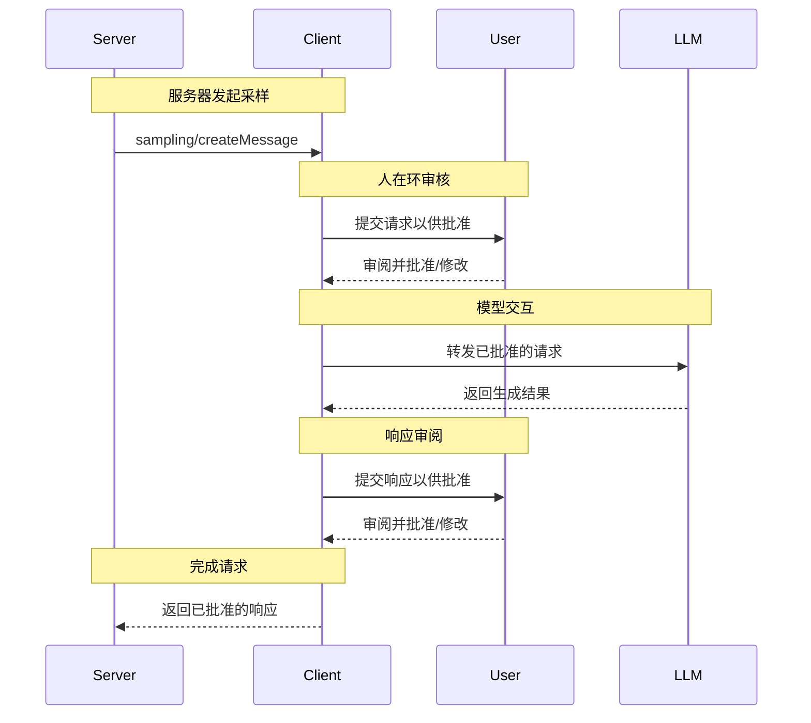

<Info>**协议修订**：2024-11-05</Info>

模型上下文协议（MCP）提供了一种标准化方式，使服务器可通过客户端向语言模型请求 LLM 采样（“补全”或“生成”）。该流程让客户端在不影响服务器利用 AI 能力的前提下，仍能掌控模型的访问、选择和权限——且服务器无需任何 API 密钥。服务器可以请求基于文本或图像的交互，并可选择在其提示模板中包含来自 MCP 服务器的上下文。

<div id="user-interaction-model">
  ## 用户交互模型
</div>

在 MCP 中，采样允许服务器实现代理式行为，使得 LLM 调用可以在其他 MCP 服务器功能中以_嵌套_方式发生。

各实现可以根据自身需求，采用任何合适的界面模式来暴露采样功能——协议本身不强制任何特定的用户交互模型。

<Warning>
  出于信任与安全以及整体安全性的考虑，**应当**始终有人在环路中，并且能够拒绝采样请求。

  应用程序**应当**：

  * 提供便于直观审核采样请求的 UI
  * 允许用户在发送前查看并编辑提示模板
  * 在交付前呈现生成的响应以供审核
</Warning>

<div id="capabilities">
  ## 功能
</div>

支持采样的客户端在[初始化](/zh/specification/2024-11-05/basic/lifecycle#initialization)时**必须**声明 `sampling` 功能：

```json
{
  "capabilities": {
    "sampling": {}
  }
}
```

<div id="protocol-messages">
  ## 协议消息
</div>

<div id="creating-messages">
  ### 创建消息
</div>

要请求语言模型生成内容，服务器应发送一个 `sampling/createMessage` 请求：

**请求：**

```json
{
  "jsonrpc": "2.0",
  "id": 1,
  "method": "sampling/createMessage",
  "params": {
    "messages": [
      {
        "role": "user",
        "content": {
          "type": "text",
          "text": "What is the capital of France?"
        }
      }
    ],
    "modelPreferences": {
      "hints": [
        {
          "name": "claude-3-sonnet"
        }
      ],
      "intelligencePriority": 0.8,
      "speedPriority": 0.5
    },
    "systemPrompt": "You are a helpful assistant.",
    "maxTokens": 100
  }
}
```

**响应：**

```json
{
  "jsonrpc": "2.0",
  "id": 1,
  "result": {
    "role": "assistant",
    "content": {
      "type": "text",
      "text": "The capital of France is Paris."
    },
    "model": "claude-3-sonnet-20240307",
    "stopReason": "endTurn"
  }
}
```

<div id="message-flow">
  ## 消息流
</div>



<div id="data-types">
  ## 数据类型
</div>

<div id="messages">
  ### 消息
</div>

采样消息可包含：

<div id="text-content">
  #### 文本内容
</div>

```json
{
  "type": "text",
  "text": "消息内容"
}
```

<div id="image-content">
  #### 图片内容
</div>

```json
{
  "type": "image",
  "data": "base64-encoded-image-data",
  "mimeType": "image/jpeg"
}
```

<div id="model-preferences">
  ### 模型偏好
</div>

在 MCP 中进行模型选择需要谨慎抽象，因为服务器和客户端可能使用不同的 AI 提供商，且模型供应各不相同。服务器不能仅以名称请求某个特定模型，因为客户端可能无法访问该精确模型，或更倾向于使用其他提供商的等效模型。

为了解决这一问题，MCP 实施了一套偏好机制，将抽象的能力优先级与可选的模型提示相结合：

<div id="capability-priorities">
  #### 能力优先级
</div>

服务器通过三个归一化的优先级值（0–1）来表达其需求：

* `costPriority`: 降低成本有多重要？值越高越倾向于更便宜的模型。
* `speedPriority`: 低延迟有多重要？值越高越倾向于更快的模型。
* `intelligencePriority`: 高级能力有多重要？值越高越倾向于
  更强大的模型。

<div id="model-hints">
  #### 模型提示
</div>

虽然优先级有助于基于特性选择模型，`hints` 则允许服务器
建议特定的模型或模型系列：

* 提示被视为可灵活匹配模型名称的子串
* 多个提示将按偏好顺序进行评估
* 客户端**可以（MAY）**将提示映射到不同提供商的等效模型
* 提示具有建议性质——最终的模型选择由客户端决定

例如：

```json
{
  "hints": [
    { "name": "claude-3-sonnet" }, // Prefer Sonnet-class models
    { "name": "claude" } // Fall back to any Claude model
  ],
  "costPriority": 0.3, // Cost is less important
  "speedPriority": 0.8, // Speed is very important
  "intelligencePriority": 0.5 // Moderate capability needs
}
```

客户端会据此处理这些偏好，从其可用选项中选择合适的模型。比如，如果客户端无法使用 Claude 模型但可以使用 Gemini，它可能会根据能力相近性将 sonnet 提示映射为 `gemini-1.5-pro`。

<div id="error-handling">
  ## 错误处理
</div>

客户端**应**在常见失败场景下返回错误：

错误示例：

```json
{
  "jsonrpc": "2.0",
  "id": 1,
  "error": {
    "code": -1,
    "message": "User rejected sampling request"
  }
}
```

<div id="security-considerations">
  ## 安全考量
</div>

1. 客户端**应**实施用户审批控件
2. 双方**应**验证消息内容
3. 客户端**应**遵循模型偏好提示
4. 客户端**应**实施限流
5. 双方**必须**妥善处理敏感数据