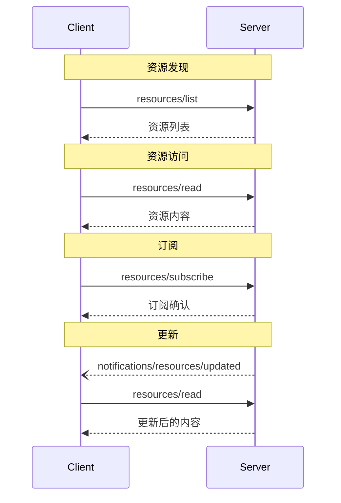

<Info>**协议修订**：2024-11-05</Info>

模型上下文协议（MCP）为服务器向客户端公开资源提供了标准化方式。资源使服务器能够共享为语言模型提供上下文的数据，例如文件、数据库模式或特定于应用的信息。每个资源都由
[URI](https://datatracker.ietf.org/doc/html/rfc3986) 唯一标识。

<div id="user-interaction-model">
  ## 用户交互模型
</div>

MCP 中的资源被设计为由**应用驱动**，由 MCP 主机应用根据自身需求决定如何纳入上下文。

例如，应用可以：

* 通过界面元素以树状或列表视图呈现资源，供用户明确选择
* 允许用户搜索并筛选可用资源
* 基于启发式规则或 AI 模型的选择，自动包含相关上下文


不过，各类实现可以自由采用任何符合其需求的界面模式来呈现资源——协议本身并不强制规定任何特定的用户交互模型。

<div id="capabilities">
  ## 功能
</div>

支持资源的服务器**必须**声明 `resources` 功能：

```json
{
  "capabilities": {
    "resources": {
      "subscribe": true,
      "listChanged": true
    }
  }
}
```

该功能包含两个可选项：

* `subscribe`：客户端是否可订阅单个资源的变更通知。
* `listChanged`：服务器在可用资源列表发生变化时是否会发送通知。

`subscribe` 和 `listChanged` 均为可选——服务器可以两者都不支持、只支持其中之一，或同时支持：

```json
{
  "capabilities": {
    "resources": {} // Neither feature supported
  }
}
```

```json
{
  "capabilities": {
    "resources": {
      "subscribe": true // Only subscriptions supported
    }
  }
}
```

```json
{
  "capabilities": {
    "resources": {
      "listChanged": true // Only list change notifications supported
    }
  }
}
```

<div id="protocol-messages">
  ## 协议消息
</div>

<div id="listing-resources">
  ### 列出资源
</div>

要发现可用资源，客户端需发送 `resources/list` 请求。该操作
支持
[分页](/zh/specification/2024-11-05/server/utilities/pagination)。

**请求：**

```json
{
  "jsonrpc": "2.0",
  "id": 1,
  "method": "resources/list",
  "params": {
    "cursor": "optional-cursor-value"
  }
}
```

**响应：**

```json
{
  "jsonrpc": "2.0",
  "id": 1,
  "result": {
    "resources": [
      {
        "uri": "file:///project/src/main.rs",
        "name": "main.rs",
        "description": "Primary application entry point",
        "mimeType": "text/x-rust"
      }
    ],
    "nextCursor": "next-page-cursor"
  }
}
```

<div id="reading-resources">
  ### 读取资源
</div>

要获取资源内容，客户端需要发送 `resources/read` 请求：

**请求：**

```json
{
  "jsonrpc": "2.0",
  "id": 2,
  "method": "resources/read",
  "params": {
    "uri": "file:///project/src/main.rs"
  }
}
```

**响应：**

```json
{
  "jsonrpc": "2.0",
  "id": 2,
  "result": {
    "contents": [
      {
        "uri": "file:///project/src/main.rs",
        "mimeType": "text/x-rust",
        "text": "fn main() {\n    println!(\"Hello world!\");\n}"
      }
    ]
  }
}
```

<div id="resource-templates">
  ### 资源模板
</div>

资源模板允许服务器使用
[URI 模板](https://datatracker.ietf.org/doc/html/rfc6570)公开参数化的资源。参数可通过[补全 API](/zh/specification/2024-11-05/server/utilities/completion)自动完成。

**请求：**

```json
{
  "jsonrpc": "2.0",
  "id": 3,
  "method": "resources/templates/list"
}
```

**响应：**

```json
{
  "jsonrpc": "2.0",
  "id": 3,
  "result": {
    "resourceTemplates": [
      {
        "uriTemplate": "file:///{path}",
        "name": "Project Files",
        "description": "Access files in the project directory",
        "mimeType": "application/octet-stream"
      }
    ]
  }
}
```

<div id="list-changed-notification">
  ### 列表变更通知
</div>

当可用资源列表发生变化时，声明了 `listChanged`
能力的服务器**应**发送一条通知：

```json
{
  "jsonrpc": "2.0",
  "method": "notifications/resources/list_changed"
}
```

<div id="subscriptions">
  ### 订阅
</div>

该协议支持对资源变更进行可选订阅。客户端可以订阅
特定资源，并在其发生变化时接收通知：

**订阅请求：**

```json
{
  "jsonrpc": "2.0",
  "id": 4,
  "method": "resources/subscribe",
  "params": {
    "uri": "file:///project/src/main.rs"
  }
}
```

**更新通知：**

```json
{
  "jsonrpc": "2.0",
  "method": "notifications/resources/updated",
  "params": {
    "uri": "file:///project/src/main.rs"
  }
}
```

<div id="message-flow">
  ## 消息流
</div>



<div id="data-types">
  ## 数据类型
</div>

<div id="resource">
  ### 资源
</div>

资源定义包括：

* `uri`: 资源的唯一标识符
* `name`: 人类可读的名称
* `description`: 可选的描述
* `mimeType`: 可选的 MIME 类型

<div id="resource-contents">
  ### 资源内容
</div>

资源可以包含文本或二进制数据：

<div id="text-content">
  #### 文本内容
</div>

```json
{
  "uri": "file:///example.txt",
  "mimeType": "text/plain",
  "text": "资源内容"
}
```

<div id="binary-content">
  #### 二进制内容
</div>

```json
{
  "uri": "file:///example.png",
  "mimeType": "image/png",
  "blob": "base64-encoded-data"
}
```

<div id="common-uri-schemes">
  ## 常见 URI 方案
</div>

该协议定义了若干标准的 URI 方案。此列表并不完整——各实现仍可自由使用其他自定义的 URI 方案。

<div id="https">
  ### https://
</div>

用于表示可在网页上获取的资源。

只有当客户端能够自行从网上获取并加载该资源——也就是说，不需要经由 MCP 服务器读取该资源——时，服务器**应当**使用此方案。

对于其他情况，即便服务器本身会通过互联网下载资源内容，服务器也**应当**优先采用其他 URI 方案，或定义一个自定义方案。

<div id="file">
  ### file://
</div>

用于标识表现如同文件系统的资源。不过，这些资源不必对应到实际的物理文件系统。

MCP 服务器**可以（MAY）**使用
[XDG MIME 类型](https://specifications.freedesktop.org/shared-mime-info-spec/0.14/ar01s02.html#id-1.3.14)
来标识 file:// 资源，例如用 `inode/directory` 表示非常规文件（如目录），这些对象本身没有标准的 MIME 类型。

<div id="git">
  ### git://
</div>

Git 版本控制集成。

<div id="error-handling">
  ## 错误处理
</div>

服务器**应**在常见失败情况下返回标准的 JSON-RPC 错误：

* 资源未找到：`-32002`
* 内部错误：`-32603`

错误示例：

```json
{
  "jsonrpc": "2.0",
  "id": 5,
  "error": {
    "code": -32002,
    "message": "Resource not found",
    "data": {
      "uri": "file:///nonexistent.txt"
    }
  }
}
```

<div id="security-considerations">
  ## 安全注意事项
</div>

1. 服务器**必须**验证所有资源 URI
2. 对敏感资源**应**实施访问控制
3. 二进制数据**必须**进行正确编码
4. 在执行操作前**应**检查资源权限