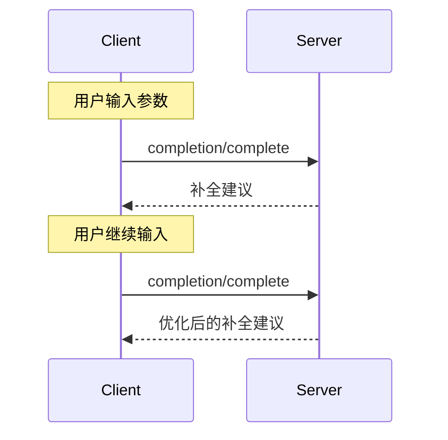

<Info>**协议修订**：2024-11-05</Info>

模型上下文协议（MCP）提供了一种标准化方式，使服务器能够为提示模板和资源 URI 提供参数自动补全建议。这使用户在输入参数值时获得上下文建议，从而实现类似 IDE 的丰富体验。

<div id="user-interaction-model">
  ## 用户交互模型
</div>

MCP 的补全功能旨在支持类似 IDE 代码补全的交互式用户体验。

例如，应用可以在用户输入时通过下拉或弹出菜单显示补全建议，并允许从可用选项中筛选和选择。

不过，各种实现可自由采用任意适合自身需求的界面模式来提供补全功能——协议本身并不强制任何特定的用户交互模型。

<div id="protocol-messages">
  ## 协议消息
</div>

<div id="requesting-completions">
  ### 请求补全
</div>

要获取补全建议，客户端需要发送 `completion/complete` 请求，并通过引用类型指定要补全的对象：

**请求：**

```json
{
  "jsonrpc": "2.0",
  "id": 1,
  "method": "completion/complete",
  "params": {
    "ref": {
      "type": "ref/prompt",
      "name": "code_review"
    },
    "argument": {
      "name": "language",
      "value": "py"
    }
  }
}
```

**响应：**

```json
{
  "jsonrpc": "2.0",
  "id": 1,
  "result": {
    "completion": {
      "values": ["python", "pytorch", "pyside"],
      "total": 10,
      "hasMore": true
    }
  }
}
```

<div id="reference-types">
  ### 引用类型
</div>

该协议支持两种补全引用类型：

| 类型           | 描述                 | 示例                                                |
| -------------- | -------------------- | --------------------------------------------------- |
| `ref/prompt`   | 按名称引用提示模板   | `{"type": "ref/prompt", "name": "code_review"}`     |
| `ref/resource` | 按 URI 引用资源      | `{"type": "ref/resource", "uri": "file:///{path}"}` |

<div id="completion-results">
  ### 补全结果
</div>

服务器会按相关性返回一个补全值数组，包含：

- 每个响应最多 100 项
- 可选的可用匹配项总数
- 一个布尔值，指示是否还有更多结果

<div id="message-flow">
  ## 消息流
</div>



<div id="data-types">
  ## 数据类型
</div>

<div id="completerequest">
  ### CompleteRequest
</div>

- `ref`: 一个 `PromptReference` 或 `ResourceReference`
- `argument`: 包含以下字段的对象：
  - `name`: 参数名
  - `value`: 当前值

<div id="completeresult">
  ### CompleteResult
</div>

- `completion`: 包含以下字段的对象：
  - `values`: 建议数组（最多 100 条）
  - `total`: 可选的匹配总数
  - `hasMore`: 是否有更多结果的标志

<div id="implementation-considerations">
  ## 实现注意事项
</div>

1. 服务器**应当**：
   - 按相关性排序返回建议
   - 在合适的情况下实现模糊匹配
   - 对补全请求进行速率限制
   - 验证所有输入

2. 客户端**应当**：
   - 对快速连续的补全请求进行防抖处理
   - 在合适的情况下缓存补全结果
   - 以优雅方式处理缺失或部分结果

<div id="security">
  ## 安全
</div>

实现 **必须**：

- 验证所有补全输入
- 实施适当的速率限制
- 控制对敏感建议的访问
- 防止因补全导致的信息泄露