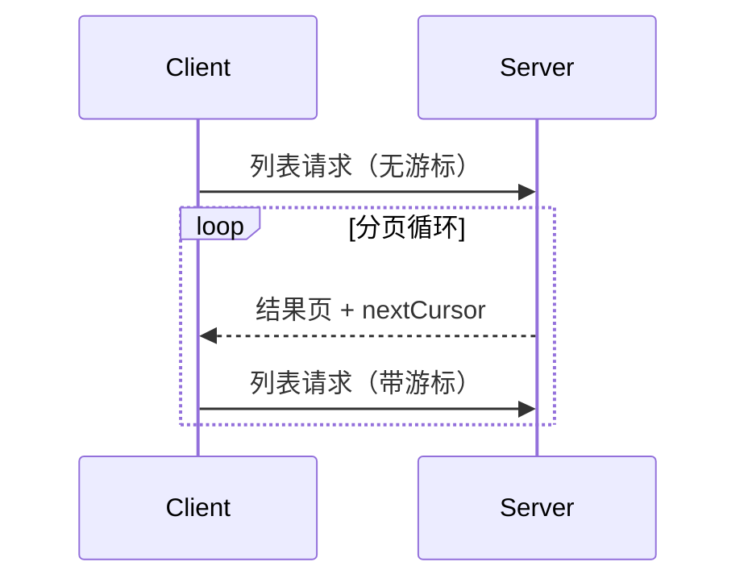

<Info>**协议修订**：2024-11-05</Info>

模型上下文协议（MCP）支持对可能返回大型结果集的列表类操作进行分页。通过分页，服务器可以将结果分成更小的批次返回，而非一次性全部返回。

在通过互联网连接外部服务时，分页尤为重要；在本地集成场景中，分页也有助于避免处理大型数据集时的性能问题。

<div id="pagination-model">
  ## 分页模型
</div>

在 MCP 中，分页采用不透明的游标机制，而非按页码编号。

- **游标**是不透明的字符串令牌，用于表示结果集中的位置
- **页面大小**由服务器决定，客户端**不得**假定固定的页面大小

<div id="response-format">
  ## 响应格式
</div>

当服务器发送包含以下内容的**响应**时，分页即开始：

- 当前结果页
- 若仍有更多结果，则包含可选的 `nextCursor` 字段

```json
{
  "jsonrpc": "2.0",
  "id": "123",
  "result": {
    "resources": [...],
    "nextCursor": "eyJwYWdlIjogM30="
  }
}
```

<div id="request-format">
  ## 请求格式
</div>

收到游标后，客户端可以通过发送包含该游标的请求来继续分页：

```json
{
  "jsonrpc": "2.0",
  "method": "resources/list",
  "params": {
    "cursor": "eyJwYWdlIjogMn0="
  }
}
```

<div id="pagination-flow">
  ## 分页流程
</div>



<div id="operations-supporting-pagination">
  ## 支持分页的操作
</div>

以下 MCP 操作支持分页：

- `resources/list` - 列出可用资源
- `resources/templates/list` - 列出资源模板
- `prompts/list` - 列出可用提示模板
- `tools/list` - 列出可用工具

<div id="implementation-guidelines">
  ## 实施指南
</div>

1. 服务器**应当（SHOULD）**：
   - 提供稳定的游标
   - 以稳健方式处理无效游标

2. 客户端**应当（SHOULD）**：
   - 将缺失的 `nextCursor` 视为结果结束
   - 同时支持分页与非分页流程

3. 客户端**必须（MUST）**将游标视为不透明令牌：
   - 不要对游标的格式作任何假设
   - 不要尝试解析或修改游标
   - 不要在会话之间持久化游标

<div id="error-handling">
  ## 错误处理
</div>

无效的游标**应**返回错误，错误代码为 -32602（参数无效）。