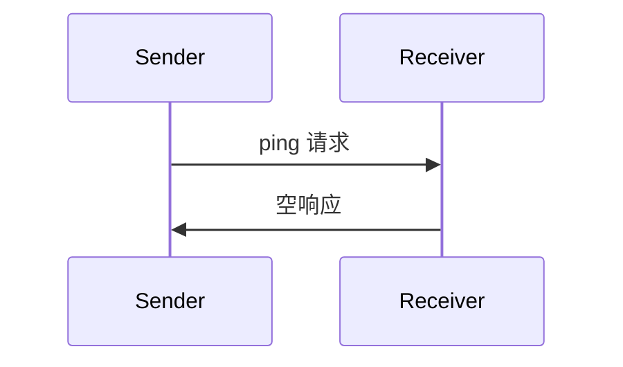

<Info>**协议修订版**：2025-03-26</Info>

模型上下文协议（MCP）提供一个可选的 ping 机制，允许任一方检查对端是否仍然响应、连接是否保持存活。

<div id="overview">
  ## 概览
</div>

Ping 功能通过简单的请求/响应模式实现。客户端或服务器都可以通过发送 `ping` 请求来发起 ping。

<div id="message-format">
  ## 消息格式
</div>

ping 请求是一个不带参数的标准 JSON-RPC 请求：

```json
{
  "jsonrpc": "2.0",
  "id": "123",
  "method": "ping"
}
```

<div id="behavior-requirements">
  ## 行为要求
</div>

1. 接收方**必须**及时以空响应进行回复：

```json
{
  "jsonrpc": "2.0",
  "id": "123",
  "result": {}
}
```

2. 如果在合理的超时时间内未收到响应，发送方**可以**：
   - 认为连接已失活
   - 终止该连接
   - 尝试执行重连流程

<div id="usage-patterns">
  ## 使用模式
</div>



<div id="implementation-considerations">
  ## 实施注意事项
</div>

- 实现**应**定期发送 ping 以检测连接是否正常
- ping 的频率**应**可配置
- 超时设置**应**与网络环境相匹配
- 为减少网络开销，**应**避免过于频繁的 ping

<div id="error-handling">
  ## 错误处理
</div>

- 超时**应**被视为连接失败
- 多次 ping 失败**可**触发连接重置
- 实现**应**记录 ping 失败以便诊断