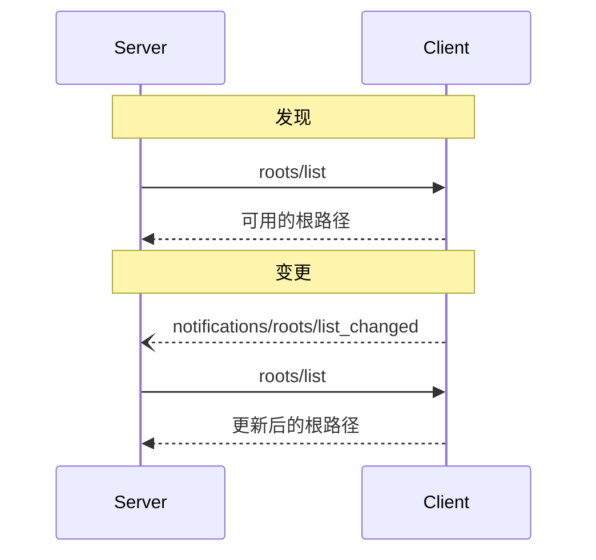

<Info>**协议修订**：2025-03-26</Info>

模型上下文协议（MCP）为客户端向服务器公开文件系统中的“根路径”提供了标准化方式。根路径界定了服务器在文件系统中可操作的范围，便于其明确可访问的目录和文件。服务器可以向支持该功能的客户端请求根路径列表，并在列表变更时收到通知。

<div id="user-interaction-model">
  ## 用户交互模型
</div>

MCP 中的根路径通常通过工作区或项目的配置界面进行公开。

例如，具体实现可以提供工作区/项目选择器，允许用户选择服务器应有访问权限的目录和文件。这可以与基于版本控制系统或项目文件的自动工作区检测相结合。

不过，各种实现可以自由采用任何满足其需求的界面模式来公开根路径——协议本身并不要求任何特定的用户交互模型。

<div id="capabilities">
  ## 功能
</div>

支持根路径的客户端在[初始化](/zh/specification/2025-03-26/basic/lifecycle#initialization)期间**必须**声明 `roots` 功能：

```json
{
  "capabilities": {
    "roots": {
      "listChanged": true
    }
  }
}
```

`listChanged` 表示当根路径列表发生变更时，客户端是否会发送通知。

<div id="protocol-messages">
  ## 协议消息
</div>

<div id="listing-roots">
  ### 列出根路径
</div>

要检索根路径，服务器会发送 `roots/list` 请求：

**请求：**

```json
{
  "jsonrpc": "2.0",
  "id": 1,
  "method": "roots/list"
}
```

**响应：**

```json
{
  "jsonrpc": "2.0",
  "id": 1,
  "result": {
    "roots": [
      {
        "uri": "file:///home/user/projects/myproject",
        "name": "My Project"
      }
    ]
  }
}
```

<div id="root-list-changes">
  ### 根路径列表更新
</div>

当根路径发生变化时，支持 `listChanged` 的客户端**必须**发送通知：

```json
{
  "jsonrpc": "2.0",
  "method": "notifications/roots/list_changed"
}
```

<div id="message-flow">
  ## 消息流
</div>



<div id="data-types">
  ## 数据类型
</div>

<div id="root">
  ### 根路径
</div>

根路径的定义包括：

* `uri`：根路径的唯一标识符。在当前规范中，这一值**必须**是 `file://` URI。
* `name`：可选的人类可读名称，用于展示。

不同用例下的根路径示例：

<div id="project-directory">
  #### 项目目录
</div>

```json
{
  "uri": "file:///home/user/projects/myproject",
  "name": "My Project"
}
```

<div id="multiple-repositories">
  #### 多个代码仓库
</div>

```json
[
  {
    "uri": "file:///home/user/repos/frontend",
    "name": "前端代码仓库"
  },
  {
    "uri": "file:///home/user/repos/backend",
    "name": "后端代码仓库"
  }
]
```

<div id="error-handling">
  ## 错误处理
</div>

客户端**应当**在常见失败情况下返回标准的 JSON-RPC 错误：

* 客户端不支持根路径：`-32601`（方法未找到）
* 内部错误：`-32603`

错误示例：

```json
{
  "jsonrpc": "2.0",
  "id": 1,
  "error": {
    "code": -32601,
    "message": "Roots not supported",
    "data": {
      "reason": "Client does not have roots capability"
    }
  }
}
```

<div id="security-considerations">
  ## 安全注意事项
</div>

1. 客户端**必须**：
   * 仅公开具有适当权限的根
   * 验证所有根的 URI，防止路径穿越
   * 实施恰当的访问控制
   * 监控根的可访问性

2. 服务器**应当**：
   * 处理根不可用的情况
   * 在操作过程中遵守根的边界
   * 将所有路径与提供的根进行校验

<div id="implementation-guidelines">
  ## 实施指南
</div>

1. 客户端**应当（SHOULD）**：
   * 在向服务器暴露根路径之前征求用户同意
   * 提供清晰明了的根路径管理界面
   * 在暴露之前验证根路径的可访问性
   * 监控根路径的变更

2. 服务器**应当（SHOULD）**：
   * 在使用前检查是否支持根路径相关能力
   * 从容处理根路径列表的变更
   * 在操作中严格遵守根路径边界
   * 适当缓存根路径信息