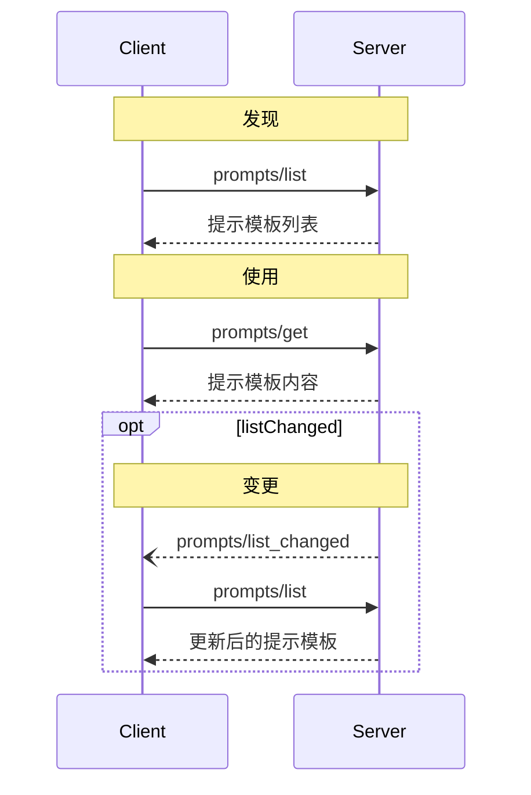

<Info>**协议修订**：2025-03-26</Info>

模型上下文协议（MCP）提供了一种标准化方式，供服务器向客户端公开提示模板。提示模板使服务器能够提供结构化消息和与语言模型交互的指令。客户端可以发现可用的提示模板、获取其内容，并通过传入参数进行定制。

<div id="user-interaction-model">
  ## 用户交互模型
</div>

提示模板被设计为由**用户掌控**，也就是说，它们由服务器暴露给客户端，旨在让用户可以明确选择并使用。

通常，提示模板会通过用户在界面中发起的命令来触发，这使用户能够自然地发现并调用可用的提示模板。

例如，作为斜杠命令：


不过，实现者可以自由地通过任何符合其需求的界面模式来暴露提示模板——协议本身并不强制任何特定的用户交互模型。

<div id="capabilities">
  ## 功能
</div>

支持提示模板的服务器在[初始化](/zh/specification/2025-03-26/basic/lifecycle#initialization)期间**必须**声明 `prompts` 功能：

```json
{
  "capabilities": {
    "prompts": {
      "listChanged": true
    }
  }
}
```

`listChanged` 表示当可用的提示模板列表发生变化时，服务器是否会发送通知。

<div id="protocol-messages">
  ## 协议消息
</div>

<div id="listing-prompts">
  ### 列出提示模板
</div>

要获取可用的提示模板，客户端需发送 `prompts/list` 请求。此操作支持[分页](/zh/specification/2025-03-26/server/utilities/pagination)。

**请求：**

```json
{
  "jsonrpc": "2.0",
  "id": 1,
  "method": "prompts/list",
  "params": {
    "cursor": "optional-cursor-value"
  }
}
```

**响应：**

```json
{
  "jsonrpc": "2.0",
  "id": 1,
  "result": {
    "prompts": [
      {
        "name": "code_review",
        "description": "请求 LLM 分析代码质量并提出改进建议",
        "arguments": [
          {
            "name": "code",
            "description": "要审查的代码",
            "required": true
          }
        ]
      }
    ],
    "nextCursor": "next-page-cursor"
  }
}
```

<div id="getting-a-prompt">
  ### 获取提示模板
</div>

要获取特定的提示模板，客户端发送 `prompts/get` 请求。参数可通过[补全 API](/zh/specification/2025-03-26/server/utilities/completion)自动补全。

**请求：**

```json
{
  "jsonrpc": "2.0",
  "id": 2,
  "method": "prompts/get",
  "params": {
    "name": "code_review",
    "arguments": {
      "code": "def hello():\n    print('world')"
    }
  }
}
```

**响应：**

```json
{
  "jsonrpc": "2.0",
  "id": 2,
  "result": {
    "description": "代码审查提示模板",
    "messages": [
      {
        "role": "user",
        "content": {
          "type": "text",
          "text": "请审查以下 Python 代码：\ndef hello():\n    print('world')"
        }
      }
    ]
  }
}
```

<div id="list-changed-notification">
  ### 列表变更通知
</div>

当可用的提示模板列表发生变更时，声明了 `listChanged`
能力的服务器**应**发送一条通知：

```json
{
  "jsonrpc": "2.0",
  "method": "notifications/prompts/list_changed"
}
```

<div id="message-flow">
  ## 消息流
</div>



<div id="data-types">
  ## 数据类型
</div>

<div id="prompt">
  ### 提示模板
</div>

提示模板的定义包括：

* `name`: 提示模板的唯一标识符
* `description`: 可选的、便于理解的描述
* `arguments`: 可选的参数列表，用于自定义

<div id="promptmessage">
  ### PromptMessage
</div>

提示中的消息可以包含：

* `role`: 使用“user”或“assistant”表示说话者
* `content`: 下列内容类型之一：

<div id="text-content">
  #### 文本内容
</div>

文本内容表示纯文本消息：

```json
{
  "type": "text",
  "text": "消息的文本内容"
}
```

这是自然语言交互中最常用的内容类型。

<div id="image-content">
  #### 图像内容
</div>

图像内容允许在消息中包含视觉信息：

```json
{
  "type": "image",
  "data": "base64-encoded-image-data",
  "mimeType": "image/png"
}
```

图像数据**必须**采用 base64 编码，并包含有效的 MIME 类型。这样可支持在需要视觉上下文时进行多模态交互。

<div id="audio-content">
  #### 音频内容
</div>

音频内容允许在消息中包含音频信息：

```json
{
  "type": "audio",
  "data": "base64-encoded-audio-data",
  "mimeType": "audio/wav"
}
```

音频数据必须采用 base64 编码，并包含有效的 MIME 类型。这使得在音频上下文重要的场景中能够进行多模态交互。

<div id="embedded-resources">
  #### 嵌入式资源
</div>

嵌入式资源允许在消息中直接引用服务器端资源：

```json
{
  "type": "resource",
  "resource": {
    "uri": "resource://example",
    "mimeType": "text/plain",
    "text": "Resource content"
  }
}
```

资源可以包含文本或二进制（blob）数据，并且**必须**包括：

* 有效的资源 URI
* 适当的 MIME 类型
* 文本内容或 base64 编码的 blob 数据（二选一）

嵌入式资源使提示模板能够将服务器管理的内容（如文档、代码示例或其他参考资料）无缝纳入对话流程。

<div id="error-handling">
  ## 错误处理
</div>

服务器**应（SHOULD）**在常见失败情况下返回标准 JSON-RPC 错误：

* 提示模板名称无效：`-32602`（参数无效）
* 缺少必填参数：`-32602`（参数无效）
* 内部错误：`-32603`（内部错误）

<div id="implementation-considerations">
  ## 实施注意事项
</div>

1. 服务器**应当**在处理前验证提示模板参数
2. 客户端**应当**为大型提示模板列表处理分页
3. 双方**应当**遵守能力协商机制

<div id="security">
  ## 安全性
</div>

实现**必须**对所有提示模板的输入和输出进行严格校验，以防止注入攻击或未经授权访问资源。