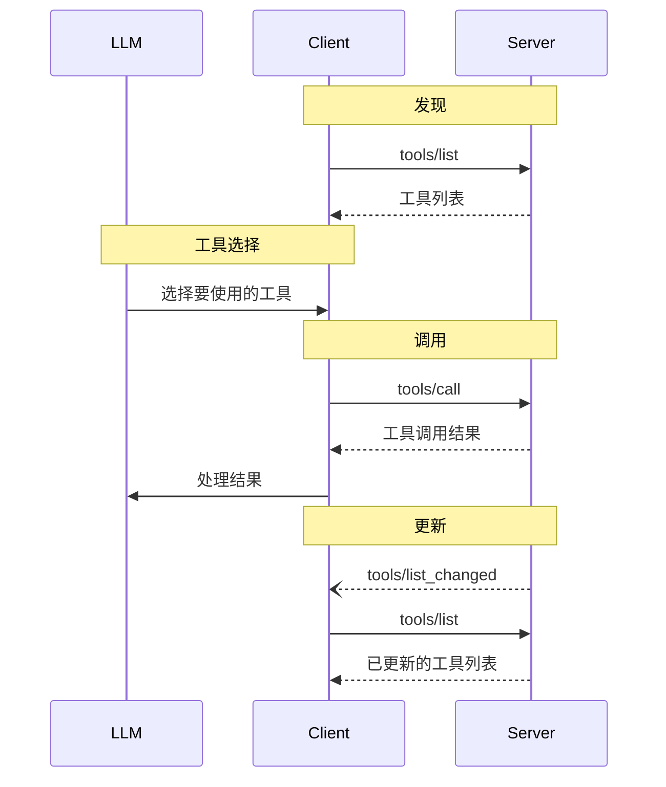

<Info>**协议修订**：2025-03-26</Info>

模型上下文协议（MCP）允许服务器公开可由语言模型调用的工具。工具使模型能够与外部系统交互，例如查询数据库、调用 API，或执行计算。每个工具都通过名称唯一标识，并包含描述其架构的元数据。

<div id="user-interaction-model">
  ## 用户交互模型
</div>

MCP 中的工具旨在由**模型控制**，这意味着语言模型可以基于其对上下文的理解和用户的提示，自动发现并调用工具。

不过，具体实现可自由通过任何适合其需求的界面模式来暴露工具——协议本身并不强制采用特定的用户交互模型。

<Warning>
  出于信任与安全及整体安全性的考虑，**应当**始终将人纳入闭环，并赋予其拒绝工具调用的能力。

  应用程序**应当**：

  * 提供 UI，清晰告知哪些工具向 AI 模型开放
  * 当工具被调用时插入明确的视觉标识
  * 在执行操作前向用户呈现确认提示，以确保有人参与闭环
</Warning>

<div id="capabilities">
  ## 功能
</div>

支持工具的服务器**必须**声明 `tools` 能力：

```json
{
  "capabilities": {
    "tools": {
      "listChanged": true
    }
  }
}
```

`listChanged` 表示当可用工具列表发生变化时，服务器是否会发送通知。

<div id="protocol-messages">
  ## 协议消息
</div>

<div id="listing-tools">
  ### 列出工具
</div>

要发现可用的工具，MCP 客户端发送一个 `tools/list` 请求。此操作支持
[分页](/zh/specification/2025-03-26/server/utilities/pagination)。

**请求：**

```json
{
  "jsonrpc": "2.0",
  "id": 1,
  "method": "tools/list",
  "params": {
    "cursor": "optional-cursor-value"
  }
}
```

**响应：**

```json
{
  "jsonrpc": "2.0",
  "id": 1,
  "result": {
    "tools": [
      {
        "name": "get_weather",
        "description": "获取指定位置的当前天气信息",
        "inputSchema": {
          "type": "object",
          "properties": {
            "location": {
              "type": "string",
              "description": "城市名或邮编"
            }
          },
          "required": ["location"]
        }
      }
    ],
    "nextCursor": "next-page-cursor"
  }
}
```

<div id="calling-tools">
  ### 调用工具
</div>

要调用工具，客户端发送一个 `tools/call` 请求：

**请求：**

```json
{
  "jsonrpc": "2.0",
  "id": 2,
  "method": "tools/call",
  "params": {
    "name": "get_weather",
    "arguments": {
      "location": "New York"
    }
  }
}
```

**响应：**

```json
{
  "jsonrpc": "2.0",
  "id": 2,
  "result": {
    "content": [
      {
        "type": "text",
        "text": "纽约当前天气：\n气温：72°F\n状况：多云间晴"
      }
    ],
    "isError": false
  }
}
```

<div id="list-changed-notification">
  ### 列表变更通知
</div>

当可用工具列表发生变更时，声明了 `listChanged`
能力的服务器**应**发送一条通知：

```json
{
  "jsonrpc": "2.0",
  "method": "notifications/tools/list_changed"
}
```

<div id="message-flow">
  ## 消息流
</div>



<div id="data-types">
  ## 数据类型
</div>

<div id="tool">
  ### 工具
</div>

工具定义包括：

* `name`：工具的唯一标识符
* `description`：面向人类的功能说明
* `inputSchema`：用于定义预期参数的 JSON Schema
* `annotations`：用于描述工具行为的可选属性

<Warning>
  出于信任与安全以及安全防护的考虑，除非来自受信任的服务器，否则客户端**必须**将工具注解视为不可信。
</Warning>

<div id="tool-result">
  ### 工具结果
</div>

工具结果可以包含多种类型的内容项（可为多个）：

<div id="text-content">
  #### 文本内容
</div>

```json
{
  "type": "text",
  "text": "工具结果文本"
}
```

<div id="image-content">
  #### 图片内容
</div>

```json
{
  "type": "image",
  "data": "base64-encoded-data",
  "mimeType": "image/png"
}
```

<div id="audio-content">
  #### 音频内容
</div>

```json
{
  "type": "audio",
  "data": "base64-encoded-audio-data",
  "mimeType": "audio/wav"
}
```

<div id="embedded-resources">
  #### 内嵌资源
</div>

[资源](/zh/specification/2025-03-26/server/resources) **可以（MAY）** 内嵌，以通过一个 URI 提供额外的上下文或数据；客户端随后可以订阅该 URI，或在之后再次获取：

```json
{
  "type": "resource",
  "resource": {
    "uri": "resource://example",
    "mimeType": "text/plain",
    "text": "Resource content"
  }
}
```

<div id="error-handling">
  ## 错误处理
</div>

工具采用两种错误上报机制：

1. **协议错误**：用于以下问题的标准 JSON-RPC 错误：
   * 未知工具
   * 参数无效
   * 服务器错误

2. **工具执行错误**：在工具结果中以 `isError: true` 上报：
   * API 调用失败
   * 输入数据无效
   * 业务逻辑错误

协议错误示例：

```json
{
  "jsonrpc": "2.0",
  "id": 3,
  "error": {
    "code": -32602,
    "message": "Unknown tool: invalid_tool_name"
  }
}
```

工具执行错误示例：

```json
{
  "jsonrpc": "2.0",
  "id": 4,
  "result": {
    "content": [
      {
        "type": "text",
        "text": "Failed to fetch weather data: API rate limit exceeded"
      }
    ],
    "isError": true
  }
}
```

<div id="security-considerations">
  ## 安全注意事项
</div>

1. 服务器**必须**：
   * 验证所有工具输入
   * 实施适当的访问控制
   * 对工具调用进行限流
   * 对工具输出进行净化/清理

2. 客户端**应当**：
   * 对敏感操作提示用户确认
   * 在调用服务器前向用户展示工具输入，以避免恶意或意外的数据外泄
   * 在传递给 LLM 之前验证工具结果
   * 为工具调用设置超时
   * 记录工具使用情况以便审计