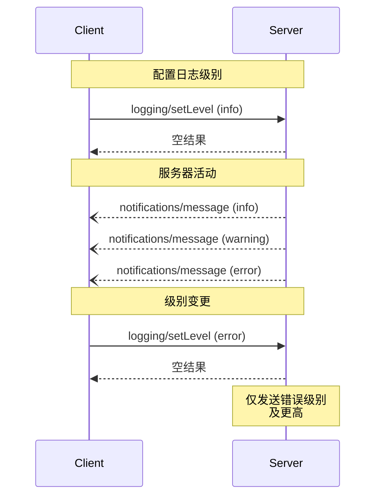

<Info>**协议修订版**：2025-03-26</Info>

模型上下文协议（MCP）提供了一种标准化方式，使服务器能够向客户端发送结构化日志消息。客户端可以通过设置最低日志级别来控制日志详尽程度；服务器会发送包含严重性级别、可选记录器名称，以及任意可序列化为 JSON 的数据的通知。

<div id="user-interaction-model">
  ## 用户交互模型
</div>

各实现可自由通过任何适合其需求的界面模式提供日志功能——协议本身并不强制采用任何特定的用户交互模型。

<div id="capabilities">
  ## 功能
</div>

会发送日志消息通知的服务器**必须**声明 `logging` 功能：

```json
{
  "capabilities": {
    "logging": {}
  }
}
```

<div id="log-levels">
  ## 日志级别
</div>

该协议遵循
[RFC 5424](https://datatracker.ietf.org/doc/html/rfc5424#section-6.2.1) 中规定的标准 syslog 严重性级别：

| Level     | Description            | Example Use Case     |
| --------- | ---------------------- | -------------------- |
| debug     | 详细调试信息           | 函数进入/退出点      |
| info      | 常规信息消息           | 操作进度更新         |
| notice    | 正常但重要的事件       | 配置变更             |
| warning   | 警告条件               | 使用已弃用功能       |
| error     | 错误条件               | 操作失败             |
| critical  | 严重条件               | 系统组件故障         |
| alert     | 需立刻采取行动         | 发现数据损坏         |
| emergency | 系统不可用             | 整个系统故障         |

<div id="protocol-messages">
  ## 协议消息
</div>

<div id="setting-log-level">
  ### 设置日志级别
</div>

要配置最低日志级别，客户端**可以**发送 `logging/setLevel` 请求：

**请求：**

```json
{
  "jsonrpc": "2.0",
  "id": 1,
  "method": "logging/setLevel",
  "params": {
    "level": "info"
  }
}
```

<div id="log-message-notifications">
  ### 日志消息通知
</div>

服务器通过 `notifications/message` 通知发送日志消息：

```json
{
  "jsonrpc": "2.0",
  "method": "notifications/message",
  "params": {
    "level": "error",
    "logger": "database",
    "data": {
      "error": "Connection failed",
      "details": {
        "host": "localhost",
        "port": 5432
      }
    }
  }
}
```

<div id="message-flow">
  ## 消息流
</div>



<div id="error-handling">
  ## 错误处理
</div>

服务器**应**针对常见失败情形返回标准的 JSON-RPC 错误：

- 日志级别无效：`-32602`（参数无效）
- 配置错误：`-32603`（内部错误）

<div id="implementation-considerations">
  ## 实施注意事项
</div>

1. 服务器 **应当**：
   - 对日志消息进行频率限制
   - 在 data 字段中包含相关上下文
   - 使用一致的日志记录器名称
   - 移除敏感信息

2. 客户端 **可以**：
   - 在 UI 中展示日志消息
   - 实现日志过滤/搜索
   - 以可视化方式呈现严重级别
   - 持久化存储日志消息

<div id="security">
  ## 安全
</div>

1. 日志消息**不得**包含：
   - 凭据或密钥
   - 个人身份信息
   - 可能协助发动攻击的内部系统细节

2. 实现**应**：
   - 对消息进行速率限制
   - 验证所有数据字段
   - 控制日志访问权限
   - 监测敏感内容