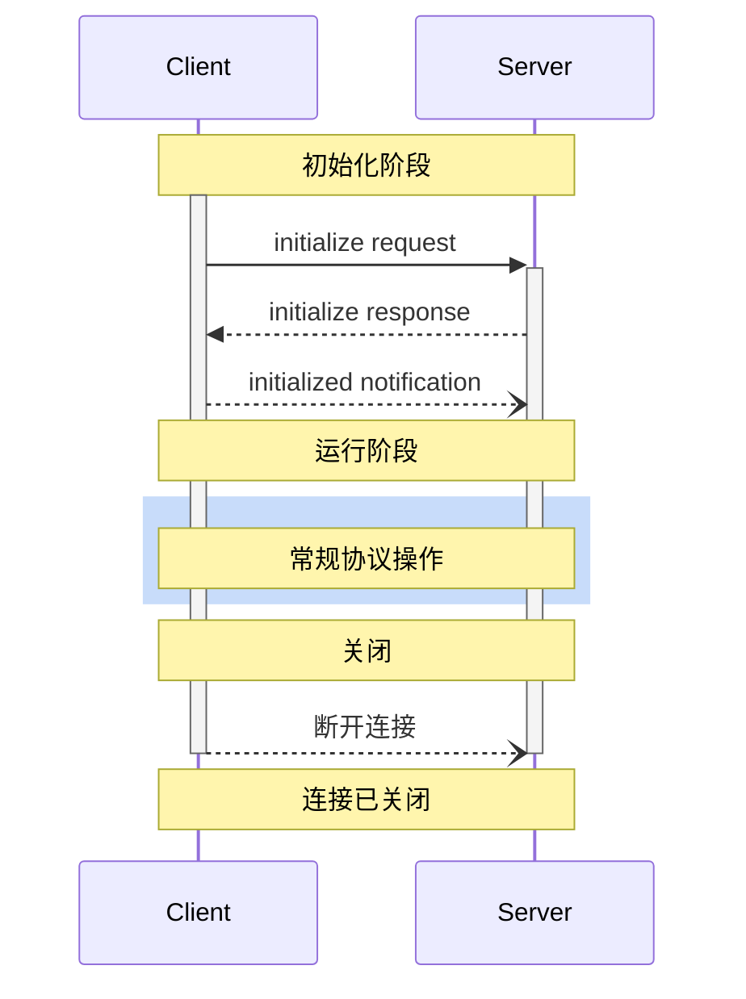

<div id="enable-section-numbers" />

<Info>**协议修订**：2025-06-18</Info>

模型上下文协议（MCP）为客户端—服务器连接定义了严格的生命周期，以确保正确进行能力协商和状态管理。

1. **初始化**：进行能力协商并达成协议版本一致
2. **运行**：按常规进行协议通信
3. **关闭**：平滑终止连接



<div id="lifecycle-phases">
  ## 生命周期阶段
</div>

<div id="initialization">
  ### 初始化
</div>

初始化阶段**必须**是客户端与服务器之间的首次交互。
在此阶段，客户端和服务器将：

* 确认协议版本兼容性
* 交换并协商功能
* 共享实现细节

客户端**必须**通过发送包含以下内容的 `initialize` 请求来启动该阶段：

* 支持的协议版本
* 客户端功能
* 客户端实现信息

```json
{
  "jsonrpc": "2.0",
  "id": 1,
  "method": "initialize",
  "params": {
    "protocolVersion": "2024-11-05",
    "capabilities": {
      "roots": {
        "listChanged": true
      },
      "sampling": {},
      "elicitation": {}
    },
    "clientInfo": {
      "name": "ExampleClient",
      "title": "Example Client Display Name",
      "version": "1.0.0"
    }
  }
}
```

服务器**必须**返回其自身的功能与信息：

```json
{
  "jsonrpc": "2.0",
  "id": 1,
  "result": {
    "protocolVersion": "2024-11-05",
    "capabilities": {
      "logging": {},
      "prompts": {
        "listChanged": true
      },
      "resources": {
        "subscribe": true,
        "listChanged": true
      },
      "tools": {
        "listChanged": true
      }
    },
    "serverInfo": {
      "name": "ExampleServer",
      "title": "Example Server Display Name",
      "version": "1.0.0"
    },
    "instructions": "Optional instructions for the client"
  }
}
```

成功完成初始化后，客户端**必须**发送一条 `initialized` 通知，表明已准备好开始正常运行：

```json
{
  "jsonrpc": "2.0",
  "method": "notifications/initialized"
}
```

* 在服务器对 `initialize` 请求作出响应之前，客户端**不应**发送除
  [pings](/zh/specification/2025-06-18/basic/utilities/ping) 之外的请求。
* 在收到 `initialized` 通知之前，服务器**不应**发送除
  [pings](/zh/specification/2025-06-18/basic/utilities/ping) 和
  [logging](/zh/specification/2025-06-18/server/utilities/logging) 之外的请求。

<div id="version-negotiation">
  #### 版本协商
</div>

在 `initialize` 请求中，客户端**必须**发送其支持的协议版本。
这**应当**是客户端支持的_最新_版本。

如果服务器支持所请求的协议版本，则**必须**以相同版本进行响应。否则，服务器**必须**以其支持的另一个协议版本进行响应，这**应当**是服务器支持的_最新_版本。

如果客户端不支持服务器响应中的版本，则**应当**断开连接。

<Note>
  如果使用 HTTP，客户端**必须**在随后向 MCP 服务器发起的所有请求中包含 `MCP-Protocol-Version: <protocol-version>` HTTP 头。
  详情参见[传输方式中的“协议版本头”一节](/zh/specification/2025-06-18/basic/transports#protocol-version-header)。
</Note>

<div id="capability-negotiation">
  #### 能力协商
</div>

客户端和服务器的能力用于确定会话期间可用的可选协议特性。

关键能力包括：

| Category | Capability     | Description                                                                               |
| -------- | -------------- | ----------------------------------------------------------------------------------------- |
| Client   | `roots`        | 提供文件系统[根路径](/zh/specification/2025-06-18/client/roots) 的能力                         |
| Client   | `sampling`     | 支持 LLM [采样](/zh/specification/2025-06-18/client/sampling) 请求                              |
| Client   | `elicitation`  | 支持服务器[信息征询](/zh/specification/2025-06-18/client/elicitation) 请求                      |
| Client   | `experimental` | 描述对非标准、实验性特性的支持                                                               |
| Server   | `prompts`      | 提供[提示模板](/zh/specification/2025-06-18/server/prompts)                                    |
| Server   | `resources`    | 提供可读取的[资源](/zh/specification/2025-06-18/server/resources)                               |
| Server   | `tools`        | 暴露可调用的[工具](/zh/specification/2025-06-18/server/tools)                                   |
| Server   | `logging`      | 输出结构化[日志消息](/zh/specification/2025-06-18/server/utilities/logging)                     |
| Server   | `completions`  | 支持参数[自动补全](/zh/specification/2025-06-18/server/utilities/completion)                     |
| Server   | `experimental` | 描述对非标准、实验性特性的支持                                                               |

能力对象还可以描述如下子能力：

* `listChanged`: 支持列表变更通知（适用于提示模板、资源和工具）
* `subscribe`: 支持订阅单个项的变更（仅限资源）

<div id="operation">
  ### 运行
</div>

在运行阶段，客户端与服务器将依据已协商的能力交换消息。

双方**必须**：

* 遵循协商确定的协议版本
* 仅使用已成功协商的能力

<div id="shutdown">
  ### 关闭
</div>

在关闭阶段，一方（通常是客户端）会以正常方式终止协议连接。协议未定义特定的关闭消息；相反，应使用底层传输机制来指示连接已终止：

<div id="stdio">
  #### stdio
</div>

对于 stdio [传输](/zh/specification/2025-06-18/basic/transports)，客户端**应**按以下步骤发起关停：

1. 先关闭到子进程（服务器）的输入流
2. 等待服务器退出；若在合理时间内未退出，则发送 `SIGTERM`
3. 若在 `SIGTERM` 后的合理时间内仍未退出，则发送 `SIGKILL`

服务器**可**通过关闭其对客户端的输出流并退出来自行发起关停。

<div id="http">
  #### HTTP
</div>

对于 HTTP [传输方式](/zh/specification/2025-06-18/basic/transports)，通过关闭相关的 HTTP 连接来表示关停。

<div id="timeouts">
  ## 超时
</div>

实现方**应当**为所有已发送的请求设置超时，以防止连接挂起和资源耗尽。如果在超时时间内未收到成功或错误响应，发送方**应当**为该请求发出[取消通知](/zh/specification/2025-06-18/basic/utilities/cancellation)，并停止等待响应。

SDK 和其他中间件**应当**支持按请求配置这些超时。

当收到与该请求对应的[进度通知](/zh/specification/2025-06-18/basic/utilities/progress)时，实现方**可以**选择重置超时计时，因为这表明工作确实在进行中。不过，实现方**应当**始终执行一个最大超时限制，无论是否有进度通知，以减少异常客户端或服务器的影响。

<div id="error-handling">
  ## 错误处理
</div>

实现**应**准备好处理以下错误情况：

* 协议版本不匹配
* 必需能力协商失败
* 请求[超时](#timeouts)

初始化错误示例：

```json
{
  "jsonrpc": "2.0",
  "id": 1,
  "error": {
    "code": -32602,
    "message": "Unsupported protocol version",
    "data": {
      "supported": ["2024-11-05"],
      "requested": "1.0.0"
    }
  }
}
```