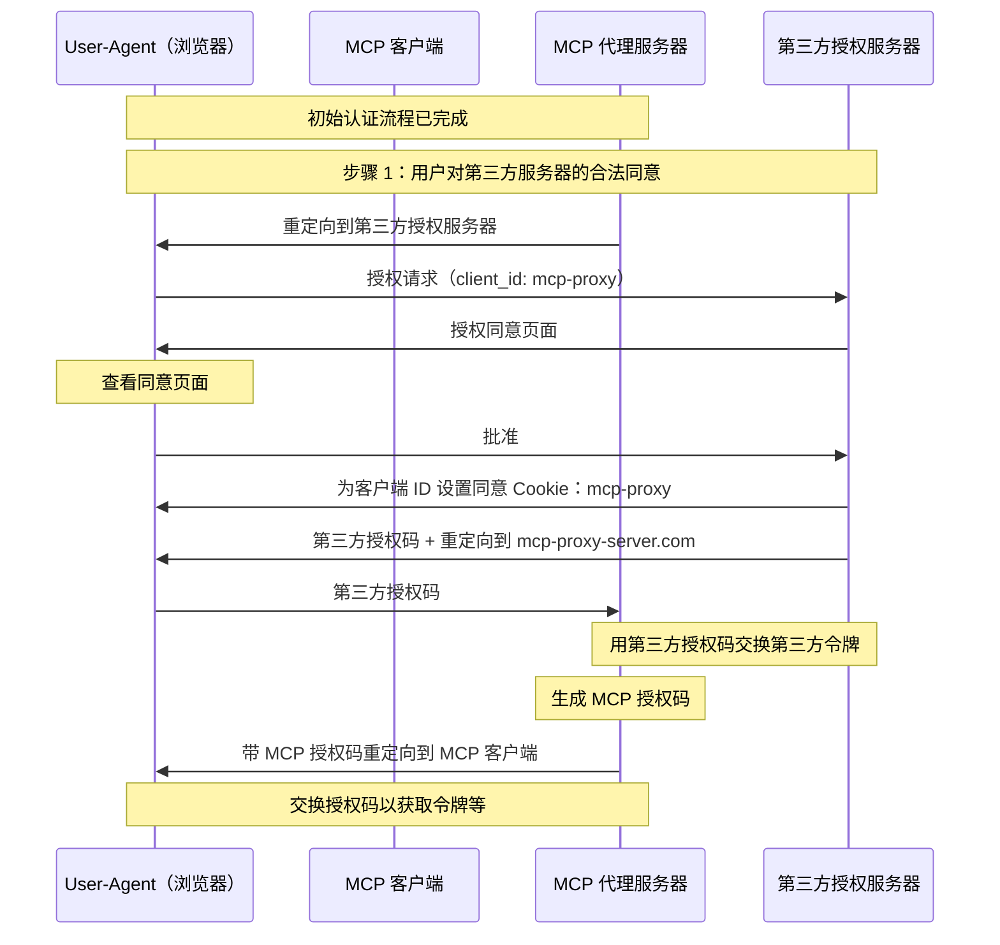
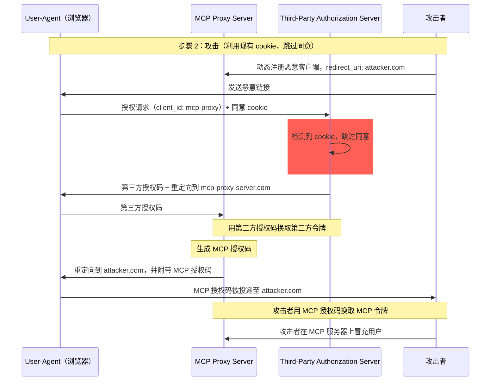
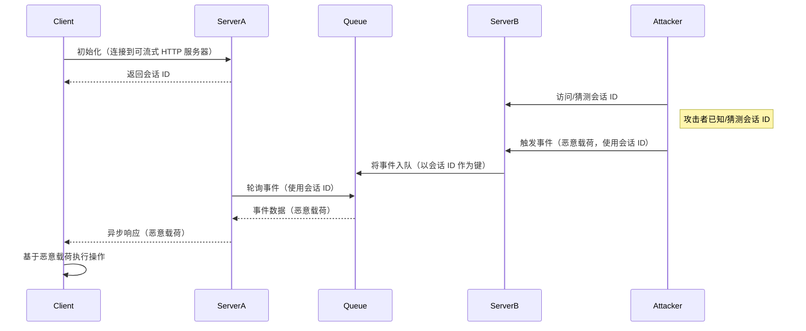
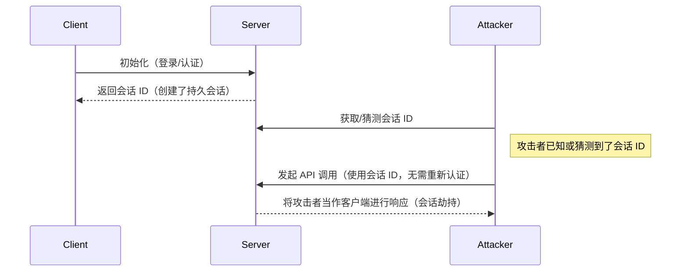

  ## 简介

  ### 目的与范围

本文档为模型上下文协议（MCP）提供安全考量，作为 MCP 授权规范的补充。本文档识别了特定于 MCP 实现的安全风险、攻击面以及最佳实践。

本文档的主要读者包括实现 MCP 授权流程的开发者、MCP 服务器运维/运营方，以及评估基于 MCP 系统的安全专业人士。本文档应与 MCP 授权规范及 [OAuth 2.0 安全最佳实践](https://datatracker.ietf.org/doc/html/rfc9700) 配合阅读。

  ## 攻击与缓解措施

本节将详细介绍针对 MCP 实现的攻击手法及其潜在的应对措施。

  ### 迷惑副手问题

攻击者可能利用充当其他资源服务器代理的 MCP 服务器，从而造成“[迷惑副手](https://en.wikipedia.org/wiki/Confused_deputy_problem)”类漏洞。

  #### 术语

**MCP Proxy Server**
: 一种 MCP 服务器，用于将 MCP 客户端连接到第三方 API，在将具体操作委派出去的同时提供 MCP 功能，并作为第三方 API 服务器的单一 OAuth 客户端。

**Third-Party Authorization Server**
: 用于保护第三方 API 的授权服务器。其可能不支持动态客户端注册（DCR），因此要求 MCP 代理对所有请求使用静态客户端 ID。

**Third-Party API**
: 提供实际 API 功能的受保护资源服务器。访问该 API 需要使用由第三方授权服务器签发的令牌。

**Static Client ID**
: MCP 代理服务器在与第三方授权服务器通信时使用的固定 OAuth 2.0 客户端标识符。该 Client ID 表示作为第三方 API 客户端的 MCP 服务器。无论是哪一个 MCP 客户端发起请求，所有 MCP 服务器与第三方 API 的交互均使用相同的该值。

  #### 架构与攻击流

  ##### 正常的 OAuth 代理用法（保留用户同意）

  ##### 恶意利用 OAuth 代理（跳过用户同意）

  #### 攻击描述

当 MCP 代理服务器使用静态客户端 ID 与不支持动态客户端注册的第三方
授权服务器进行认证时，可能发生如下攻击：

1. 用户通过 MCP 代理服务器按常规方式认证以访问第三方 API
2. 在此流程中，第三方授权服务器在用户代理上设置一个 cookie，
   表示已对该静态客户端 ID 给出同意
3. 攻击者随后向用户发送一个恶意链接，其中包含精心构造的授权请求，带有恶意的重定向 URI，以及一个新近动态注册的客户端 ID
4. 当用户点击该链接时，其浏览器仍保留着先前合法请求留下的同意 cookie
5. 第三方授权服务器检测到该 cookie，并跳过同意页面
6. MCP 授权码被重定向到攻击者的服务器（在动态客户端注册期间的恶意 redirect_uri 中指定）
7. 攻击者将窃取的授权码交换为 MCP 服务器的访问令牌，而无需用户的明确同意
8. 攻击者此时即可以受害用户的身份访问第三方 API

  #### 缓解措施

使用静态客户端 ID 的 MCP 代理服务器在将请求转发至第三方授权服务器之前，**必须**先为每个动态注册的客户端取得用户同意（第三方可能还会要求额外同意）。

  ### Token 透传

“Token 透传”是一种反模式，指 MCP 服务器从 MCP 客户端接收 token，却不验证这些 token 是否确实是颁发给该 MCP 服务器本身的，而是将其直接“透传”给下游 API。

  #### 风险

令牌透传在[授权规范](/zh/specification/2025-06-18/basic/authorization)中被明确禁止，因为它会带来多种安全风险，包括：

* **规避安全控制**
  * MCP 服务器或下游 API 可能实施了重要的安全控制，如速率限制、请求验证或流量监控，这些控制依赖令牌的受众或其他凭证约束。如果客户端能够直接获取并使用令牌调用下游 API，而未经过 MCP 服务器的适当验证或确保令牌针对正确的服务签发，就会绕过这些控制。
* **可追责性与审计链问题**
  * 当客户端使用由上游签发且对 MCP 服务器可能不透明的访问令牌发起调用时，MCP 服务器将无法识别或区分各个 MCP 客户端。
  * 下游资源服务器的日志可能会显示请求似乎来自具有不同身份的其他来源，而非实际转发令牌的 MCP 服务器。
  * 以上因素都会使事件调查、控制与审计更加困难。
  * 如果 MCP 服务器在未验证令牌的声明（例如角色、权限或受众）或其他元数据的情况下转发令牌，持有被盗令牌的恶意行为者可以借由该服务器作为代理进行数据外泄。
* **信任边界问题**
  * 下游资源服务器会将信任授予特定实体。这种信任可能包含关于来源或客户端行为模式的假设。破坏这一信任边界可能导致意料之外的问题。
  * 如果令牌在缺乏适当验证的情况下被多个服务接受，攻击者一旦攻陷其中一个服务，便可能利用该令牌访问其他关联服务。
* **未来兼容性风险**
  * 即使 MCP 服务器目前以“纯代理”的方式运作，未来也可能需要增加安全控制。从一开始就进行正确的令牌受众隔离，有助于后续演进安全模型。

  #### 缓解

MCP 服务器**不得**接受任何未明确签发给该 MCP 服务器的令牌。

  ### 会话劫持

会话劫持是一种攻击方式：服务器向客户端分配会话 ID，未授权方设法获取并使用相同的会话 ID，冒充原始客户端并代表其执行未授权操作。

  #### 会话劫持式提示注入

  #### 会话劫持与身份冒用

  #### 攻击描述

当存在多个有状态的 HTTP 服务器处理 MCP 请求时，可能出现以下攻击向量：

**会话劫持型提示注入**

1. 客户端连接到**服务器 A**并获得一个会话 ID。

2. 攻击者获取现有会话 ID，并使用该会话 ID 向**服务器 B**发送恶意事件。
   * 当服务器支持[重投递/可恢复流](/zh/specification/2025-06-18/basic/transports#resumability-and-redelivery)时，在收到响应前故意中止请求，可能导致原客户端通过用于服务器发送事件的 GET 请求恢复该请求。
   * 如果某个服务器因工具调用（如 `notifications/tools/list_changed`）而触发服务器发送事件，且该调用会影响服务器提供的工具，客户端最终可能出现其并未知晓已启用的工具。

3. **服务器 B**将该事件（与该会话 ID 关联）入队到共享队列。

4. **服务器 A**使用该会话 ID 轮询队列并取出恶意负载。

5. **服务器 A**将恶意负载作为异步或恢复后的响应发送给客户端。

6. 客户端接收并执行该恶意负载，导致潜在的安全受损。

**会话劫持型冒充**

1. MCP 客户端与 MCP 服务器完成认证，创建一个持久会话 ID。
2. 攻击者获取该会话 ID。
3. 攻击者使用该会话 ID 向 MCP 服务器发起调用。
4. MCP 服务器未进行额外授权检查，将攻击者视为合法用户，从而放行未授权的访问或操作。

  #### 缓解措施

为防止会话劫持和事件注入攻击，应实施以下措施：

实现授权的 MCP 服务器**必须（MUST）**验证所有入站请求。
MCP 服务器**不得（MUST NOT）**使用会话进行身份验证。

MCP 服务器**必须（MUST）**使用安全的、非确定性的会话 ID。
生成的会话 ID（例如 UUID）**应该（SHOULD）**使用安全随机数生成器。避免使用可预测或连续的会话标识符，以免被攻击者猜测。轮换或设置会话 ID 过期也可降低风险。

MCP 服务器**应该（SHOULD）**将会话 ID 绑定到用户特定信息。
在存储或传输与会话相关的数据时（例如在队列中），将会话 ID 与授权用户的唯一信息（如其内部用户 ID）组合使用。采用类似 `<user_id>:<session_id>` 的键格式。这样可确保即使攻击者猜到会话 ID，也无法冒充其他用户，因为用户 ID 是从用户令牌派生的，而非由客户端提供。

MCP 服务器也可按需利用其他唯一标识符。