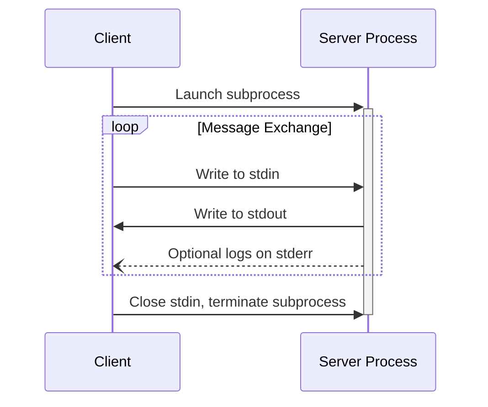
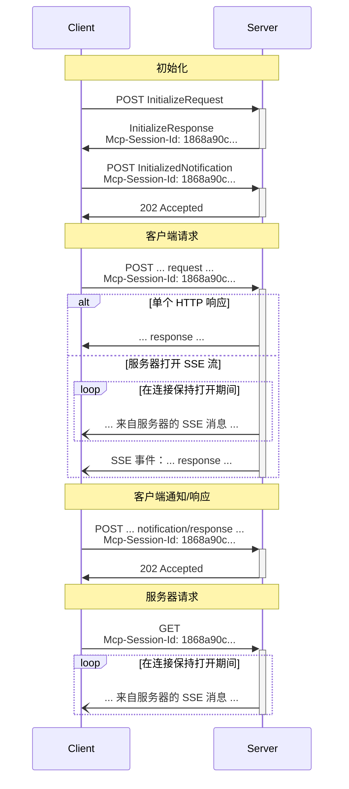

<Info>**协议修订**：2025-06-18</Info>

MCP 使用 JSON-RPC 对消息进行编码。JSON-RPC 消息**必须**采用 UTF-8 编码。

该协议目前为客户端与服务器之间的通信定义了两种标准传输方式：

1. [stdio](#stdio)，通过标准输入和标准输出进行通信
2. [可流式 HTTP](#streamable-http)

客户端在条件允许时**应当**支持 stdio。

客户端和服务器也可以以可插拔的方式实现
[自定义传输方式](#custom-transports)。

  ## stdio

在 **stdio** 传输方式中：

* 客户端将 MCP 服务器作为子进程启动。
* 服务器从其标准输入（`stdin`）读取 JSON-RPC 消息，并将消息写入其标准输出（`stdout`）。
* 每条消息都是单独的 JSON-RPC 请求、通知或响应。
* 消息以换行符分隔，且**不得**包含嵌入的换行符。
* 服务器**可以**将 UTF-8 字符串写入其标准错误（`stderr`）以用于日志记录。客户端**可以**捕获、转发或忽略这些日志。
* 服务器**不得**向其 `stdout` 写入任何非有效 MCP 消息的内容。
* 客户端**不得**向服务器的 `stdin` 写入任何非有效 MCP 消息的内容。

  ## 可流式 HTTP

<Info>
  这取代了协议版本 2024-11-05 中的 [HTTP+SSE
  传输](/zh/specification/2024-11-05/basic/transports#http-with-sse)。请参阅下方的[向后兼容性](#backwards-compatibility)
  指南。
</Info>

在可流式 HTTP 传输方式中，服务器作为独立进程运行，能够处理多个客户端连接。该传输使用 HTTP 的 POST 和 GET 请求。服务器可以选择使用
[服务器发送事件](https://en.wikipedia.org/wiki/Server-sent_events)（SSE）来流式传输
多条服务器消息。这既支持基础的 MCP 服务器，也支持功能更丰富、包含流式传输以及服务器到客户端通知与请求的服务器。

服务器必须提供一个单一的 HTTP 端点路径（以下简称
“MCP 端点”），同时支持 POST 和 GET 方法。例如，它可以是类似 `https://example.com/mcp` 的 URL。

  #### 安全警告

在实现可流式 HTTP 传输方式时：

1. 服务器**必须**在所有入站连接上校验 `Origin` 头，以防止 DNS 重绑定攻击
2. 在本地运行时，服务器**应**仅绑定到 localhost（127.0.0.1），而非所有网络接口（0.0.0.0）
3. 服务器**应**为所有连接实施健全的身份验证

若缺乏上述防护，攻击者可能通过 DNS 重绑定从远程网站与本地 MCP 服务器交互。

  ### 向服务器发送消息

客户端发送的每条 JSON-RPC 消息都**必须**作为新的 HTTP POST 请求发送到 MCP 端点。

1. 客户端**必须**使用 HTTP POST 将 JSON-RPC 消息发送到 MCP 端点。
2. 客户端**必须**在请求中包含 `Accept` 头，并同时声明支持 `application/json` 和 `text/event-stream` 两种内容类型。
3. POST 请求的主体**必须**是单个 JSON-RPC 的 *request*、*notification* 或 *response*。
4. 如果输入是 JSON-RPC 的 *response* 或 *notification*：
   * 如果服务器接受该输入，服务器**必须**返回 HTTP 状态码 202 Accepted，且无响应体。
   * 如果服务器无法接受该输入，**必须**返回一个 HTTP 错误状态码（例如 400 Bad Request）。HTTP 响应体**可以**是一个不带 `id` 的 JSON-RPC *error response*。
5. 如果输入是 JSON-RPC 的 *request*，服务器**必须**返回 `Content-Type: text/event-stream`（启动 SSE 流），或返回 `Content-Type: application/json`（返回一个 JSON 对象）。客户端**必须**同时支持这两种情况。
6. 如果服务器启动了 SSE 流：
   * SSE 流**应当**最终包含对该 POST 正文中 JSON-RPC *request* 的 JSON-RPC *response*。
   * 在发送 JSON-RPC *response* 之前，服务器**可以**先发送 JSON-RPC *requests* 和 *notifications*。这些消息**应当**与发起的客户端 *request* 相关。
   * 在发送收到的 JSON-RPC *request* 的 JSON-RPC *response* 之前，服务器**不应**关闭 SSE 流，除非[会话](#session-management)已过期。
   * 发送完 JSON-RPC *response* 之后，服务器**应当**关闭 SSE 流。
   * 断开连接**可能**在任何时候发生（例如由于网络状况）。因此：
     * 不应将断开连接理解为客户端取消其请求。
     * 如需取消，客户端**应当**显式发送 MCP `CancelledNotification`。
     * 为避免因断开而导致消息丢失，服务器**可以**使该流[可恢复](#resumability-and-redelivery)。

  ### 监听来自服务器的消息

1. 客户端**可以（MAY）**向 MCP 端点发起 HTTP GET。这样可以打开一个
   服务器发送事件（SSE）流，使服务器无需客户端先通过 HTTP POST
   发送数据即可与其通信。
2. 客户端**必须（MUST）**包含 `Accept` 头，将 `text/event-stream` 列为
   支持的内容类型。
3. 服务器**必须（MUST）**在响应该 HTTP GET 时返回 `Content-Type: text/event-stream`，
   否则必须返回 HTTP 405 Method Not Allowed，表示服务器在此端点不提供 SSE 流。
4. 如果服务器启动了 SSE 流：
   * 服务器**可以（MAY）**在该流上发送 JSON-RPC 的请求（*requests*）和通知（*notifications*）。
   * 这些消息**应该（SHOULD）**与客户端并发进行的任何 JSON-RPC
     请求（*request*）无关。
   * 服务器**不得（MUST NOT）**在该流上发送 JSON-RPC 响应（*response*），**除非**
     是在[恢复](#resumability-and-redelivery)与先前客户端请求关联的流时。
   * 服务器**可以（MAY）**随时关闭该 SSE 流。
   * 客户端**可以（MAY）**随时关闭该 SSE 流。

  ### 多重连接

1. 客户端**可以（MAY）**同时保持与多个 SSE 流的连接。
2. 服务器**必须（MUST）**仅在已连接的某一个流上发送其每条 JSON-RPC 消息；也就是说，**不得（MUST NOT）**在多个流上广播相同的消息。
   * 通过使流[可恢复](#resumability-and-redelivery)，**可以（MAY）**降低消息丢失的风险。

  ### 可恢复性与重新投递

为支持在连接中断后恢复，以及重新投递可能丢失的消息：

1. 服务器**可以（MAY）**按照
   [SSE 标准](https://html.spec.whatwg.org/multipage/server-sent-events.html#event-stream-interpretation)，在其 SSE 事件中附加一个 `id` 字段。
   * 如果存在，该 ID **必须（MUST）**在该
     [会话](#session-management)内的所有流中全局唯一——如果未使用会话管理，则需在与该特定客户端的所有流中全局唯一。
2. 如果客户端希望在连接中断后继续，会**应该（SHOULD）**向 MCP 端点发起 HTTP
   GET 请求，并包含
   [`Last-Event-ID`](https://html.spec.whatwg.org/multipage/server-sent-events.html#the-last-event-id-header)
   头，以指示其接收到的最后一个事件 ID。
   * 服务器**可以（MAY）**使用该头，在_被断开的流上_重放最后一个事件 ID 之后本应发送的消息，并从该点恢复该流。
   * 服务器**禁止（MUST NOT）**重放本应在不同流上投递的消息。

换言之，这些事件 ID 应由服务器按_每个流_进行分配，以在该特定流内充当游标。

  ### 会话管理

一个 MCP“会话”由客户端与服务器之间逻辑相关的交互组成，始于[初始化阶段](/zh/specification/2025-06-18/basic/lifecycle)。为支持希望建立有状态会话的服务器：

1. 使用可流式 HTTP 传输方式的服务器**可以**在初始化时分配会话 ID，并在包含 `InitializeResult` 的 HTTP 响应中通过 `Mcp-Session-Id` 头返回该 ID。
   * 会话 ID **应当**具有全局唯一性并满足密码学安全要求（例如，安全生成的 UUID、JWT，或加密哈希）。
   * 会话 ID **必须**仅包含可见的 ASCII 字符（范围 0x21 到 0x7E）。
2. 如果服务器在初始化期间返回了 `Mcp-Session-Id`，则使用可流式 HTTP 传输方式的客户端**必须**在其所有后续 HTTP 请求的 `Mcp-Session-Id` 头中包含该值。
   * 要求会话 ID 的服务器**应当**对缺少 `Mcp-Session-Id` 头的请求（初始化除外）返回 HTTP 400 Bad Request。
3. 服务器**可以**随时终止会话，之后它**必须**对包含该会话 ID 的请求返回 HTTP 404 Not Found。
4. 当客户端对包含 `Mcp-Session-Id` 的请求收到 HTTP 404 响应时，**必须**通过发送不附带会话 ID 的新的 `InitializeRequest` 来启动一个新会话。
5. 不再需要特定会话的客户端（例如用户即将退出客户端应用）**应当**向 MCP 端点发送带有 `Mcp-Session-Id` 头的 HTTP DELETE，以显式终止该会话。
   * 服务器**可以**对该请求返回 HTTP 405 Method Not Allowed，表示服务器不允许客户端终止会话。

  ### 时序图

  ### 协议版本请求头

如果使用 HTTP，客户端**必须**在随后向 MCP 服务器发起的所有请求中包含 `MCP-Protocol-Version: <protocol-version>` HTTP 头部，以便 MCP 服务器能够根据 MCP 协议版本进行响应。

例如：`MCP-Protocol-Version: 2025-06-18`

客户端发送的协议版本**应当**为[在初始化期间协商](/zh/specification/2025-06-18/basic/lifecycle#version-negotiation)的版本。

为保持向后兼容性，如果服务器未收到 `MCP-Protocol-Version`
头部，且没有其他方式识别版本（例如依赖初始化期间协商的协议版本），则服务器**应当**假定协议版本为 `2025-03-26`。

如果服务器收到的请求包含无效或不受支持的
`MCP-Protocol-Version`，则**必须**返回 `400 Bad Request`。

  ### 向后兼容

客户端和服务器可以按照以下方式与已弃用的 [HTTP+SSE
传输](/zh/specification/2024-11-05/basic/transports#http-with-sse)（自协议版本 2024-11-05 起）保持向后兼容：

希望支持旧版客户端的**服务器**应：

* 继续同时提供旧传输方式的 SSE 和 POST 端点，并与为可流式 HTTP 传输定义的
  新“MCP 端点”并行提供。
  * 也可以将旧的 POST 端点与新的 MCP 端点合并，但这可能会引入不必要的复杂性。

希望支持旧版服务器的**客户端**应：

1. 接受用户提供的 MCP 服务器 URL，它可能指向使用旧传输或新传输的服务器。
2. 尝试向该服务器 URL 发送一个 `InitializeRequest` 的 POST 请求，并带上如上所述的 `Accept` 头：
   * 如果成功，客户端可以认为该服务器支持新的可流式 HTTP 传输。
   * 如果以 HTTP 4xx 状态码失败（例如 405 Method Not Allowed 或 404 Not Found）：
     * 向该服务器 URL 发起 GET 请求，预期这将打开一个 SSE 流，并将 `endpoint` 事件作为首个事件返回。
     * 当收到 `endpoint` 事件时，客户端可以认为该服务器运行的是旧的 HTTP+SSE 传输，并应在后续所有通信中使用该传输方式。

  ## 自定义传输方式

客户端和服务器**可以（MAY）**实现额外的自定义传输机制，以满足其特定需求。该协议与传输无关，可在任何支持双向消息交换的通信通道上实现。

选择支持自定义传输方式的实现者**必须（MUST）**确保保留由 MCP 定义的 JSON-RPC 消息格式和生命周期要求。自定义传输方式**应（SHOULD）**记录其特定的连接建立与消息交换模式，以促进互操作性。