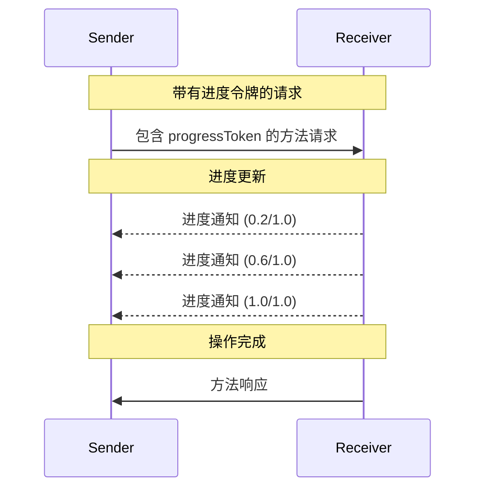

<div id="enable-section-numbers" />

<Info>**协议修订**：2025-06-18</Info>

模型上下文协议（MCP）通过通知消息为耗时操作提供可选的进度跟踪。任一方都可以发送进度通知，用于更新操作状态。

<div id="progress-flow">
  ## 进度流程
</div>

当一方希望接收某个请求的进度更新时，应在请求的元数据中包含一个
`progressToken`。

- 进度令牌 **必须** 为字符串或整数
- 进度令牌可由发送方以任意方式生成，但 **必须** 在所有活跃请求中保持唯一

```json
{
  "jsonrpc": "2.0",
  "id": 1,
  "method": "some_method",
  "params": {
    "_meta": {
      "progressToken": "abc123"
    }
  }
}
```

随后，接收方 **可以** 发送包含以下内容的进度通知：

- 原始进度令牌
- 截至目前的进度值
- 可选的“total”值
- 可选的“message”值

```json
{
  "jsonrpc": "2.0",
  "method": "notifications/progress",
  "params": {
    "progressToken": "abc123",
    "progress": 50,
    "total": 100,
    "message": "Reticulating splines..."
  }
}
```

- 即使总量未知，`progress` 值也 **必须** 随每次通知递增。
- `progress` 和 `total` 的值 **可以** 为浮点数。
- `message` 字段 **应** 提供相关且便于理解的进度信息。

<div id="behavior-requirements">
  ## 行为要求
</div>

1. 进度通知**必须**仅引用以下令牌：
   - 在活跃请求中提供的
   - 与正在进行的操作相关联的

2. 进度请求的接收方**可以**：
   - 选择不发送任何进度通知
   - 以其认为合适的任意频率发送通知
   - 若总量未知则可省略该值



<div id="implementation-notes">
  ## 实现说明
</div>

- 发送方和接收方**应**跟踪活跃的进度令牌
- 双方**应**实施速率限制以防止泛洪
- 完成后**必须**停止发送进度通知