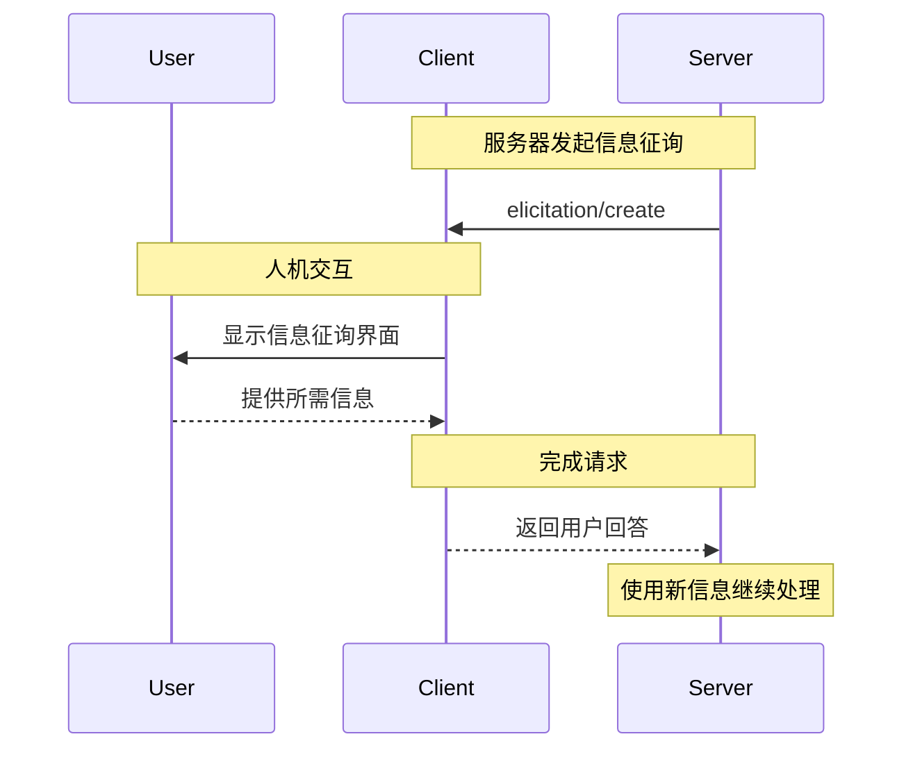

<div id="enable-section-numbers" />

<Info>**协议修订**：2025-06-18</Info>

<Note>
  本版本的模型上下文协议（MCP）规范中新引入了信息征询，其设计可能会在后续的协议版本中演进。
</Note>

模型上下文协议（MCP）提供了一种标准化方式，使服务器能够在交互过程中通过客户端向用户请求额外信息。该流程在使服务器能够动态收集必要信息的同时，允许客户端始终保持对用户交互和数据共享的控制。
服务器使用 JSON Schema 向用户请求结构化数据，并据此验证响应。

<div id="user-interaction-model">
  ## 用户交互模型
</div>

在 MCP 中，信息征询允许服务器通过在其他 MCP 服务器功能内以“嵌套”方式发起用户输入请求，从而实现交互式工作流。

各实现可自由采用任何满足其需求的界面范式来提供信息征询——协议本身不强制规定任何特定的用户交互模型。

<Warning>
  出于可信性与安全考虑：

  * 服务器**不得**使用信息征询来请求敏感信息。

  应用程序**应当**：

  * 提供清晰的界面，标明正在请求信息的是哪个服务器
  * 允许用户在发送前审阅并修改其回复
  * 尊重用户隐私，并提供明确的拒绝与取消选项
</Warning>

<div id="capabilities">
  ## 功能
</div>

支持信息征询的客户端在[初始化](/zh/specification/2025-06-18/basic/lifecycle#initialization)阶段**必须**声明 `elicitation` 能力：

```json
{
  "capabilities": {
    "elicitation": {}
  }
}
```

<div id="protocol-messages">
  ## 协议报文
</div>

<div id="creating-elicitation-requests">
  ### 创建信息征询请求
</div>

要向用户征询信息，服务器会发送一个 `elicitation/create` 请求：

<div id="simple-text-request">
  #### 简单文本请求
</div>

**请求：**

```json
{
  "jsonrpc": "2.0",
  "id": 1,
  "method": "elicitation/create",
  "params": {
    "message": "请输入你的 GitHub 用户名",
    "requestedSchema": {
      "type": "object",
      "properties": {
        "name": {
          "type": "string"
        }
      },
      "required": ["name"]
    }
  }
}
```

**响应：**

```json
{
  "jsonrpc": "2.0",
  "id": 1,
  "result": {
    "action": "accept",
    "content": {
      "name": "octocat"
    }
  }
}
```

<div id="structured-data-request">
  #### 结构化数据请求
</div>

**请求：**

```json
{
  "jsonrpc": "2.0",
  "id": 2,
  "method": "elicitation/create",
  "params": {
    "message": "Please provide your contact information",
    "requestedSchema": {
      "type": "object",
      "properties": {
        "name": {
          "type": "string",
          "description": "Your full name"
        },
        "email": {
          "type": "string",
          "format": "email",
          "description": "Your email address"
        },
        "age": {
          "type": "number",
          "minimum": 18,
          "description": "Your age"
        }
      },
      "required": ["name", "email"]
    }
  }
}
```

**响应：**

```json
{
  "jsonrpc": "2.0",
  "id": 2,
  "result": {
    "action": "accept",
    "content": {
      "name": "Monalisa Octocat",
      "email": "octocat@github.com",
      "age": 30
    }
  }
}
```

**拒绝响应示例：**

```json
{
  "jsonrpc": "2.0",
  "id": 2,
  "result": {
    "action": "decline"
  }
}
```

**取消响应示例：**

```json
{
  "jsonrpc": "2.0",
  "id": 2,
  "result": {
    "action": "cancel"
  }
}
```

<div id="message-flow">
  ## 消息流
</div>



<div id="request-schema">
  ## 请求架构
</div>

`requestedSchema` 字段允许服务器使用受限的 JSON Schema 子集来定义期望的响应结构。为简化客户端实现，信息征询的架构仅限于仅包含原始类型属性的扁平对象：

```json
"requestedSchema": {
  "type": "object",
  "properties": {
    "propertyName": {
      "type": "string",
      "title": "显示名称",
      "description": "该属性的说明"
    },
    "anotherProperty": {
      "type": "number",
      "minimum": 0,
      "maximum": 100
    }
  },
  "required": ["propertyName"]
}
```

<div id="supported-schema-types">
  ### 支持的架构类型
</div>

该架构仅限于以下原始类型：

1. **字符串架构**

   ```json
   {
     "type": "string",
     "title": "Display Name",
     "description": "Description text",
     "minLength": 3,
     "maxLength": 50,
     "format": "email" // Supported: "email", "uri", "date", "date-time"
   }
   ```

   支持的格式：`email`、`uri`、`date`、`date-time`

2. **数值架构**

   ```json
   {
     "type": "number", // or "integer"
     "title": "Display Name",
     "description": "Description text",
     "minimum": 0,
     "maximum": 100
   }
   ```

3. **布尔架构**

   ```json
   {
     "type": "boolean",
     "title": "Display Name",
     "description": "Description text",
     "default": false
   }
   ```

4. **枚举架构**
   ```json
   {
     "type": "string",
     "title": "Display Name",
     "description": "Description text",
     "enum": ["option1", "option2", "option3"],
     "enumNames": ["Option 1", "Option 2", "Option 3"]
   }
   ```

客户端可以使用此架构来：

1. 生成合适的输入表单
2. 在发送前验证用户输入
3. 为用户提供更好的指引

请注意，为简化客户端实现，有意不支持复杂的嵌套结构、对象数组以及其他高级 JSON Schema 功能。

<div id="response-actions">
  ## 响应动作
</div>

信息征询的响应采用三种动作模型，用于清晰区分不同的用户行为：

```json
{
  "jsonrpc": "2.0",
  "id": 1,
  "result": {
    "action": "accept", // or "decline" or "cancel"
    "content": {
      "propertyName": "value",
      "anotherProperty": 42
    }
  }
}
```

这三种响应动作为：

1. **Accept**（`action: "accept"`）：用户明确同意并提交了数据
   * `content` 字段包含与请求的 schema 匹配的已提交数据
   * 示例：用户点击“Submit”、“OK”、“Confirm”等

2. **Decline**（`action: "decline"`）：用户明确拒绝请求
   * 通常省略 `content` 字段
   * 示例：用户点击“Reject”、“Decline”、“No”等

3. **Cancel**（`action: "cancel"`）：用户未作出明确选择而退出
   * 通常省略 `content` 字段
   * 示例：用户关闭对话框、点击对话框外部、按下 Escape 等

服务器应恰当地处理每种状态：

* **Accept**：处理已提交的数据
* **Decline**：处理明确拒绝（例如，提供替代方案）
* **Cancel**：处理取消/打断（例如，稍后再次提示）

<div id="security-considerations">
  ## 安全注意事项
</div>

1. 服务器**不得**通过信息征询请求敏感信息
2. 客户端**应当**提供用户批准控制
3. 双方**应当**依据提供的模式对信息征询内容进行校验
4. 客户端**应当**清晰标示由哪个服务器发起的信息请求
5. 客户端**应当**允许用户随时拒绝信息征询请求
6. 客户端**应当**实施速率限制
7. 客户端**应当**以清晰方式呈现信息征询请求，说明请求哪些信息以及原因