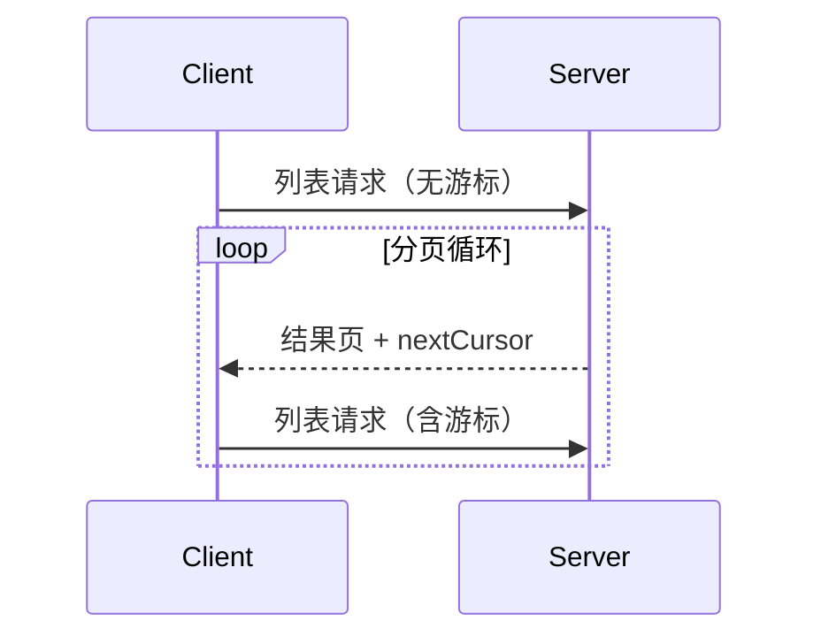

<div id="enable-section-numbers" />

<Info>**协议修订**：2025-06-18</Info>

模型上下文协议（MCP）支持对可能返回大型结果集的列表操作进行分页。通过分页，服务器可以分批返回较小的结果集，而非一次性全部返回。

在通过互联网连接外部服务时，分页尤为重要；对于本地集成同样有用，可避免在处理大型数据集时出现性能问题。

<div id="pagination-model">
  ## 分页模型
</div>

MCP 采用不透明的游标式分页，而非按页码编号。

- **游标** 是一个不透明的字符串令牌，表示在结果集中的位置
- **页面大小** 由服务器决定，客户端 **不得** 假设固定的页面大小

<div id="response-format">
  ## 响应格式
</div>

当服务器发送包含以下内容的**响应**时，即开始分页：

- 当前结果页
- 如有更多结果，包含可选的 `nextCursor` 字段

```json
{
  "jsonrpc": "2.0",
  "id": "123",
  "result": {
    "resources": [...],
    "nextCursor": "eyJwYWdlIjogM30="
  }
}
```

<div id="request-format">
  ## 请求格式
</div>

在收到光标后，客户端可以通过发送包含该光标的请求来继续分页：

```json
{
  "jsonrpc": "2.0",
  "method": "resources/list",
  "params": {
    "cursor": "eyJwYWdlIjogMn0="
  }
}
```

<div id="pagination-flow">
  ## 分页流程
</div>



<div id="operations-supporting-pagination">
  ## 支持分页的操作
</div>

以下 MCP 操作支持分页：

- `resources/list` - 列出可用的资源
- `resources/templates/list` - 列出资源模板
- `prompts/list` - 列出可用的提示模板
- `tools/list` - 列出可用的工具

<div id="implementation-guidelines">
  ## 实施指南
</div>

1. 服务器**应当**：
   - 提供稳定的游标
   - 优雅地处理无效游标

2. 客户端**应当**：
   - 将缺少 `nextCursor` 视为结果结束
   - 同时支持分页和非分页流程

3. 客户端**必须**将游标视为不透明令牌：
   - 不要对游标格式作出假设
   - 不要尝试解析或修改游标
   - 不要在不同会话之间持久化游标

<div id="error-handling">
  ## 错误处理
</div>

无效的游标**应**返回错误，错误代码为 -32602（参数无效）。