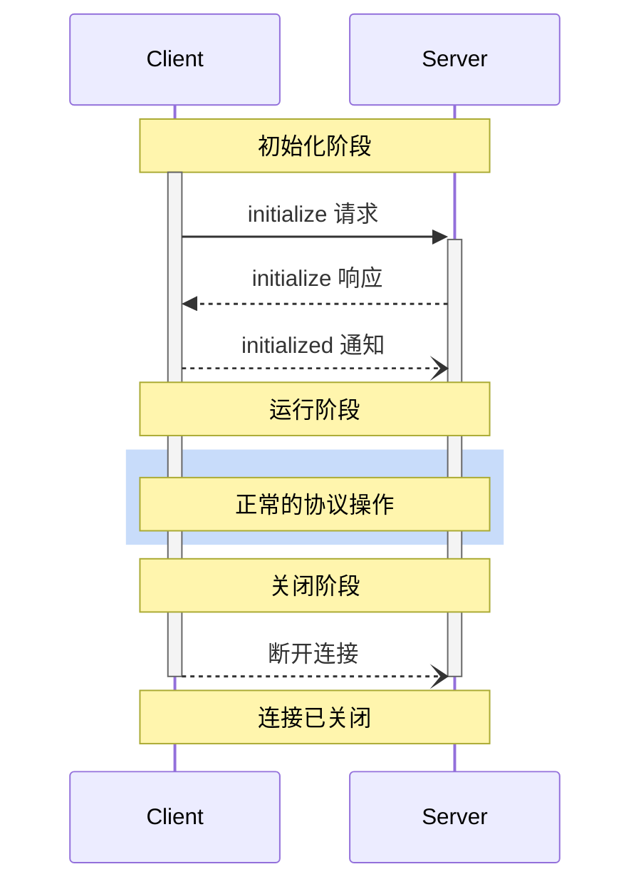

<div id="enable-section-numbers" />

<Info>**协议版本**：草案</Info>

模型上下文协议（MCP）为客户端与服务器之间的连接定义了严谨的生命周期，以确保正确的能力协商与状态管理。

1. **初始化**：进行能力协商并达成协议版本一致
2. **运行**：正常的协议通信
3. **关闭**：优雅终止连接



<div id="lifecycle-phases">
  ## 生命周期阶段
</div>

<div id="initialization">
  ### 初始化
</div>

初始化阶段**必须**是客户端与服务器之间的首次交互。
在此阶段，客户端和服务器将：

* 确认协议版本兼容性
* 交换并协商功能能力
* 共享实现细节

客户端**必须**通过发送 `initialize` 请求来启动此阶段，请求中包含：

* 支持的协议版本
* 客户端能力
* 客户端实现信息

```json
{
  "jsonrpc": "2.0",
  "id": 1,
  "method": "initialize",
  "params": {
    "protocolVersion": "2024-11-05",
    "capabilities": {
      "roots": {
        "listChanged": true
      },
      "sampling": {},
      "elicitation": {}
    },
    "clientInfo": {
      "name": "ExampleClient",
      "title": "Example Client Display Name",
      "version": "1.0.0",
      "icons": [
        {
          "src": "https://example.com/icon.png",
          "mimeType": "image/png",
          "sizes": "48x48"
        }
      ],
      "websiteUrl": "https://example.com"
    }
  }
}
```

服务器**必须**以其自身的能力与信息进行响应：

```json
{
  "jsonrpc": "2.0",
  "id": 1,
  "result": {
    "protocolVersion": "2024-11-05",
    "capabilities": {
      "logging": {},
      "prompts": {
        "listChanged": true
      },
      "resources": {
        "subscribe": true,
        "listChanged": true
      },
      "tools": {
        "listChanged": true
      }
    },
    "serverInfo": {
      "name": "ExampleServer",
      "title": "Example Server Display Name",
      "version": "1.0.0",
      "icons": [
        {
          "src": "https://example.com/server-icon.svg",
          "mimeType": "image/svg+xml",
          "sizes": "any"
        }
      ],
      "websiteUrl": "https://example.com/server"
    },
    "instructions": "Optional instructions for the client"
  }
}
```

成功初始化后，客户端**必须**发送 `initialized` 通知，以表明已准备好开始正常运行：

```json
{
  "jsonrpc": "2.0",
  "method": "notifications/initialized"
}
```

* 在服务器对 `initialize` 请求作出响应之前，客户端**不应**发送除
  [pings](/zh/specification/draft/basic/utilities/ping) 之外的请求。
* 在收到 `initialized` 通知之前，服务器**不应**发送除
  [pings](/zh/specification/draft/basic/utilities/ping) 和
  [logging](/zh/specification/draft/server/utilities/logging) 之外的请求。

<div id="version-negotiation">
  #### 版本协商
</div>

在 `initialize` 请求中，客户端**必须**发送其支持的协议版本。
这**应当**是客户端所支持的_最新_版本。

如果服务器支持所请求的协议版本，则**必须**返回相同版本；否则，服务器**必须**返回其支持的另一个协议版本。这**应当**是服务器所支持的_最新_版本。

如果客户端不支持服务器响应中的版本，则**应当**断开连接。

<Note>
  如果使用 HTTP，客户端**必须**在发往 MCP 服务器的所有后续请求中包含 `MCP-Protocol-Version: <protocol-version>` HTTP 头。
  详情见[传输方式中的“协议版本头”一节](/zh/specification/draft/basic/transports#protocol-version-header)。
</Note>

<div id="capability-negotiation">
  #### 功能协商
</div>

客户端和服务器的功能共同确定会话期间可用的可选协议特性。

主要功能包括：

| 类别 | 功能           | 描述                                                                                     |
| ---- | -------------- | ---------------------------------------------------------------------------------------- |
| 客户端 | `roots`        | 提供文件系统[根路径](/zh/specification/draft/client/roots)的能力                               |
| 客户端 | `sampling`     | 支持 LLM [采样](/zh/specification/draft/client/sampling) 请求                                 |
| 客户端 | `elicitation`  | 支持服务器[信息征询](/zh/specification/draft/client/elicitation)请求                           |
| 客户端 | `experimental` | 描述对非标准实验性特性的支持                                                               |
| 服务器 | `prompts`      | 提供[提示模板](/zh/specification/draft/server/prompts)                                       |
| 服务器 | `resources`    | 提供可读取的[资源](/zh/specification/draft/server/resources)                                   |
| 服务器 | `tools`        | 暴露可调用的[工具](/zh/specification/draft/server/tools)                                     |
| 服务器 | `logging`      | 发出结构化的[日志消息](/zh/specification/draft/server/utilities/logging)                      |
| 服务器 | `completions`  | 支持参数[自动补全](/zh/specification/draft/server/utilities/completion)                       |
| 服务器 | `experimental` | 描述对非标准实验性特性的支持                                                               |

功能对象可以描述如下子功能：

* `listChanged`: 支持列表变更通知（适用于提示模板、资源和工具）
* `subscribe`: 支持订阅单个条目的变更（仅资源）

<div id="operation">
  ### 运行
</div>

在运行阶段，客户端和服务器将根据已协商的能力交换消息。

双方均**必须**：

* 遵守协商的协议版本
* 仅使用已成功协商的能力

<div id="shutdown">
  ### 关闭
</div>

在关闭阶段，一方（通常为客户端）会以干净的方式终止协议连接。协议未定义特定的关闭消息——应通过底层传输机制来指示连接终止：

<div id="stdio">
  #### stdio
</div>

对于 stdio [传输方式](/zh/specification/draft/basic/transports)，客户端**应当（SHOULD）**通过以下方式发起关停：

1. 先关闭到子进程（服务器）的输入流
2. 等待服务器退出；如果服务器在合理时间内未退出，则发送 `SIGTERM`
3. 如果在发送 `SIGTERM` 后的合理时间内服务器仍未退出，则发送 `SIGKILL`

服务器**可以（MAY）**通过关闭到客户端的输出流并退出来自行发起关停。

<div id="http">
  #### HTTP
</div>

对于 HTTP [传输方式](/zh/specification/draft/basic/transports)，关闭是通过终止相应的 HTTP 连接来表示的。

<div id="timeouts">
  ## 超时
</div>

实现方**应当**为所有已发送的请求设置超时时间，以防止连接挂起和资源耗尽。当请求在超时时间内未收到成功或错误响应时，发送方**应当**为该请求发出[取消通知](/zh/specification/draft/basic/utilities/cancellation)并停止等待响应。

SDK 和其他中间件**应当**允许按请求粒度配置这些超时。

实现方**可以**在收到与该请求对应的[进度通知](/zh/specification/draft/basic/utilities/progress)时选择重置超时计时，因为这表明工作确在进行中。然而，无论是否收到进度通知，实现方**应当**始终强制执行最大超时时间，以限制异常客户端或服务器的影响。

<div id="error-handling">
  ## 错误处理
</div>

实现方**应当**准备处理以下错误情况：

* 协议版本不匹配
* 无法协商所需能力
* 请求[超时](#timeouts)

初始化错误示例：

```json
{
  "jsonrpc": "2.0",
  "id": 1,
  "error": {
    "code": -32602,
    "message": "Unsupported protocol version",
    "data": {
      "supported": ["2024-11-05"],
      "requested": "1.0.0"
    }
  }
}
```