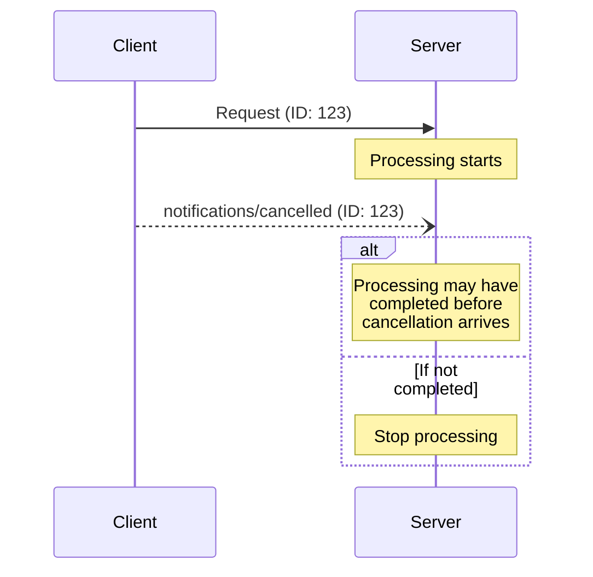

<div id="enable-section-numbers" />

<Info>**协议修订**：草案</Info>

模型上下文协议（MCP）通过通知消息支持对进行中的请求进行可选取消。任一方都可以发送取消通知，表示先前发出的请求应当终止。

<div id="cancellation-flow">
  ## 取消流程
</div>

当一方需要取消进行中的请求时，应发送一条 `notifications/cancelled` 通知，内容包括：

- 要取消的请求 ID
- 可选的原因字符串，可用于记录或展示

```json
{
  "jsonrpc": "2.0",
  "method": "notifications/cancelled",
  "params": {
    "requestId": "123",
    "reason": "User requested cancellation"
  }
}
```

<div id="behavior-requirements">
  ## 行为要求
</div>

1. 取消通知**必须**仅引用以下请求：
   - 先前在同一方向上发出的
   - 被认为仍在处理中
2. 客户端**不得**取消 `initialize` 请求
3. 取消通知的接收方**应当**：
   - 停止处理被取消的请求
   - 释放相关资源
   - 不再为被取消的请求发送响应
4. 在以下情况下，接收方**可以**忽略取消通知：
   - 被引用的请求未知
   - 处理已完成
   - 该请求不可取消
5. 取消通知的发送方**应当**忽略随后到达的对此请求的任何响应

<div id="timing-considerations">
  ## 时序注意事项
</div>

由于网络延迟，取消通知可能会在请求处理完成之后才到达，甚至可能在响应已经发送之后才到达。

双方**必须**从容地处理这些竞态条件：



<div id="implementation-notes">
  ## 实施说明
</div>

- 双方**应**记录取消原因以便调试
- 当请求取消时，应用 UI **应**予以标示

<div id="error-handling">
  ## 错误处理
</div>

无效的取消通知**应当**被忽略：

- 未知的请求 ID
- 已完成的请求
- 畸形通知

这样既能保持通知的“发出即忘”特性，又能在异步通信中容纳竞态条件。