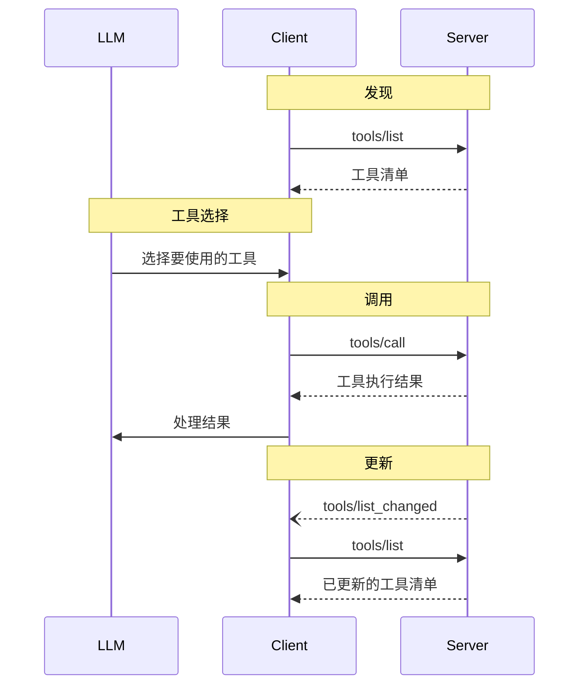

<div id="enable-section-numbers" />

<Info>**协议修订版**：草案</Info>

模型上下文协议（MCP）允许服务器公开可由语言模型调用的工具。工具使模型能够与外部系统交互，例如查询数据库、调用 API 或执行计算。每个工具都通过名称唯一标识，并包含描述其架构的元数据。

<div id="user-interaction-model">
  ## 用户交互模型
</div>

MCP 中的工具被设计为由**模型控制**，这意味着语言模型可以基于其上下文理解和用户的提示，自动发现并调用工具。

不过，各种实现可以自由通过任何符合其需求的界面模式来暴露工具——协议本身并不规定任何特定的用户交互模型。

<Warning>
  出于信任与安全和整体安全性的考虑，**应当**始终有人参与，并具备拒绝工具调用的能力。

  应用程序**应当**：

  * 提供 UI，清晰说明向 AI 模型暴露了哪些工具
  * 在工具被调用时加入清晰的视觉指示
  * 在执行操作前向用户呈现确认提示，以确保有人参与决策
</Warning>

<div id="capabilities">
  ## 功能
</div>

支持工具的服务器**必须**声明 `tools` 功能：

```json
{
  "capabilities": {
    "tools": {
      "listChanged": true
    }
  }
}
```

`listChanged` 表示服务器在可用工具列表发生变更时是否会发送通知。

<div id="protocol-messages">
  ## 协议消息
</div>

<div id="listing-tools">
  ### 列出工具
</div>

要发现可用的工具，客户端需发送 `tools/list` 请求。该操作支持
[分页](/zh/specification/draft/server/utilities/pagination)。

**请求：**

```json
{
  "jsonrpc": "2.0",
  "id": 1,
  "method": "tools/list",
  "params": {
    "cursor": "optional-cursor-value"
  }
}
```

**响应：**

```json
{
  "jsonrpc": "2.0",
  "id": 1,
  "result": {
    "tools": [
      {
        "name": "get_weather",
        "title": "天气信息提供器",
        "description": "获取指定位置的实时天气信息",
        "inputSchema": {
          "type": "object",
          "properties": {
            "location": {
              "type": "string",
              "description": "城市名或邮政编码"
            }
          },
          "required": ["location"]
        },
        "icons": [
          {
            "src": "https://example.com/weather-icon.png",
            "mimeType": "image/png",
            "sizes": "48x48"
          }
        ]
      }
    ],
    "nextCursor": "next-page-cursor"
  }
}
```

<div id="calling-tools">
  ### 调用工具
</div>

要调用某个工具，客户端需发送 `tools/call` 请求：

**请求：**

```json
{
  "jsonrpc": "2.0",
  "id": 2,
  "method": "tools/call",
  "params": {
    "name": "get_weather",
    "arguments": {
      "location": "New York"
    }
  }
}
```

**响应：**

```json
{
  "jsonrpc": "2.0",
  "id": 2,
  "result": {
    "content": [
      {
        "type": "text",
        "text": "Current weather in New York:\nTemperature: 72°F\nConditions: Partly cloudy"
      }
    ],
    "isError": false
  }
}
```

<div id="list-changed-notification">
  ### 列表变更通知
</div>

当可用工具列表发生变更时，声明了 `listChanged`
能力的服务器**应当**发送一条通知：

```json
{
  "jsonrpc": "2.0",
  "method": "notifications/tools/list_changed"
}
```

<div id="message-flow">
  ## 消息流
</div>



<div id="data-types">
  ## 数据类型
</div>

<div id="tool">
  ### 工具
</div>

工具定义包括：

* `name`: 工具的唯一标识符
* `title`: 可选，用于展示的人类可读名称
* `description`: 人类可读的功能描述
* `inputSchema`: 定义预期参数的 JSON Schema
* `outputSchema`: 可选，定义预期输出结构的 JSON Schema
* `annotations`: 可选，用于描述工具行为的属性

<Warning>
  出于信任与安全及安全性考虑，除非来自受信任的服务器，否则客户端**必须**将工具注解视为不受信任。
</Warning>

<div id="tool-result">
  ### 工具结果
</div>

工具结果可能包含[**结构化**](#structured-content)或**非结构化**内容。

**非结构化**内容会在结果的`content`字段中返回，并且可以包含多个不同类型的内容项：

<Note>
  所有内容类型（文本、图像、音频、资源链接和内嵌资源）
  均支持可选的
  [注解](/zh/specification/draft/server/resources#annotations)，用于提供
  关于受众、优先级和修改时间的元数据。这与资源和提示模板使用的注解格式相同。
</Note>

<div id="text-content">
  #### 文本内容
</div>

```json
{
  "type": "text",
  "text": "工具结果文本"
}
```

<div id="image-content">
  #### 图像内容
</div>

```json
{
  "type": "image",
  "data": "base64-encoded-data",
  "mimeType": "image/png",
  "annotations": {
    "audience": ["user"],
    "priority": 0.9
  }
}
```

<div id="audio-content">
  #### 音频内容
</div>

```json
{
  "type": "audio",
  "data": "base64-encoded-audio-data",
  "mimeType": "audio/wav"
}
```

<div id="resource-links">
  #### 资源链接
</div>

工具**可以（MAY）**返回指向[资源](/zh/specification/draft/server/resources)的链接，以提供额外的上下文或数据。在这种情况下，工具会返回一个可由客户端订阅或获取的 URI：

```json
{
  "type": "resource_link",
  "uri": "file:///project/src/main.rs",
  "name": "main.rs",
  "description": "Primary application entry point",
  "mimeType": "text/x-rust"
}
```

资源链接支持与常规资源相同的[资源注解](/zh/specification/draft/server/resources#annotations)，以帮助客户端理解如何使用它们。

<Info>
  工具返回的资源链接不保证会出现在 `resources/list` 请求的结果中。
</Info>

<div id="embedded-resources">
  #### 内嵌资源
</div>

[资源](/zh/specification/draft/server/resources) **可以**内嵌，通过合适的 [URI 方案](zh/./resources#common-uri-schemes) 提供额外的上下文或数据。使用内嵌资源的服务器 **应** 实现 `resources` 能力：

```json
{
  "type": "resource",
  "resource": {
    "uri": "file:///project/src/main.rs",
    "title": "Project Rust Main File",
    "mimeType": "text/x-rust",
    "text": "fn main() {\n    println!(\"Hello world!\");\n}",
    "annotations": {
      "audience": ["user", "assistant"],
      "priority": 0.7,
      "lastModified": "2025-05-03T14:30:00Z"
    }
  }
}
```

内嵌资源与常规资源相同，支持相同的[资源注解](/zh/specification/draft/server/resources#annotations)，以帮助客户端理解如何使用它们。

<div id="structured-content">
  #### 结构化内容
</div>

返回的**结构化**内容以 JSON 对象的形式置于结果的 `structuredContent` 字段中。

为保持向后兼容，返回结构化内容的工具还应在 TextContent 块中同时返回该 JSON 的序列化形式。

<div id="output-schema">
  #### 输出架构（Schema）
</div>

工具也可以提供输出架构，用于对结构化结果进行验证。
如果提供了输出架构：

* 服务器**必须**提供符合该架构的结构化结果。
* 客户端**应当**依据该架构验证结构化结果。

带有输出架构的工具示例：

```json
{
  "name": "get_weather_data",
  "title": "Weather Data Retriever",
  "description": "Get current weather data for a location",
  "inputSchema": {
    "type": "object",
    "properties": {
      "location": {
        "type": "string",
        "description": "City name or zip code"
      }
    },
    "required": ["location"]
  },
  "outputSchema": {
    "type": "object",
    "properties": {
      "temperature": {
        "type": "number",
        "description": "Temperature in celsius"
      },
      "conditions": {
        "type": "string",
        "description": "Weather conditions description"
      },
      "humidity": {
        "type": "number",
        "description": "Humidity percentage"
      }
    },
    "required": ["temperature", "conditions", "humidity"]
  }
}
```

该工具的有效响应示例：

```json
{
  "jsonrpc": "2.0",
  "id": 5,
  "result": {
    "content": [
      {
        "type": "text",
        "text": "{\"temperature\": 22.5, \"conditions\": \"Partly cloudy\", \"humidity\": 65}"
      }
    ],
    "structuredContent": {
      "temperature": 22.5,
      "conditions": "Partly cloudy",
      "humidity": 65
    }
  }
}
```

提供输出架构有助于客户端和 LLM 理解并正确处理结构化的工具输出，体现在：

* 使响应能够进行严格的架构校验
* 提供类型信息，便于更好地与编程语言集成
* 引导客户端和 LLM 正确解析并使用返回的数据
* 改进文档质量与开发者体验

<div id="error-handling">
  ## 错误处理
</div>

工具采用两种错误报告机制：

1. **协议错误**：用于如下问题的标准 JSON-RPC 错误：
   * 未知工具
   * 参数无效
   * 服务器错误

2. **工具执行错误**：在工具结果中通过 `isError: true` 报告：
   * API 调用失败
   * 输入数据无效
   * 业务逻辑错误

协议错误示例：

```json
{
  "jsonrpc": "2.0",
  "id": 3,
  "error": {
    "code": -32602,
    "message": "Unknown tool: invalid_tool_name"
  }
}
```

工具执行错误示例：

```json
{
  "jsonrpc": "2.0",
  "id": 4,
  "result": {
    "content": [
      {
        "type": "text",
        "text": "Failed to fetch weather data: API rate limit exceeded"
      }
    ],
    "isError": true
  }
}
```

<div id="security-considerations">
  ## 安全注意事项
</div>

1. 服务器**必须**：
   * 验证所有工具输入
   * 实施适当的访问控制
   * 对工具调用进行速率限制
   * 对工具输出进行清理/净化

2. 客户端**应**：
   * 在执行敏感操作时提示用户确认
   * 在调用服务器之前向用户展示工具输入，以避免恶意或意外的数据外泄
   * 在传递给 LLM 之前验证工具结果
   * 为工具调用设置超时
   * 记录工具使用情况以备审计