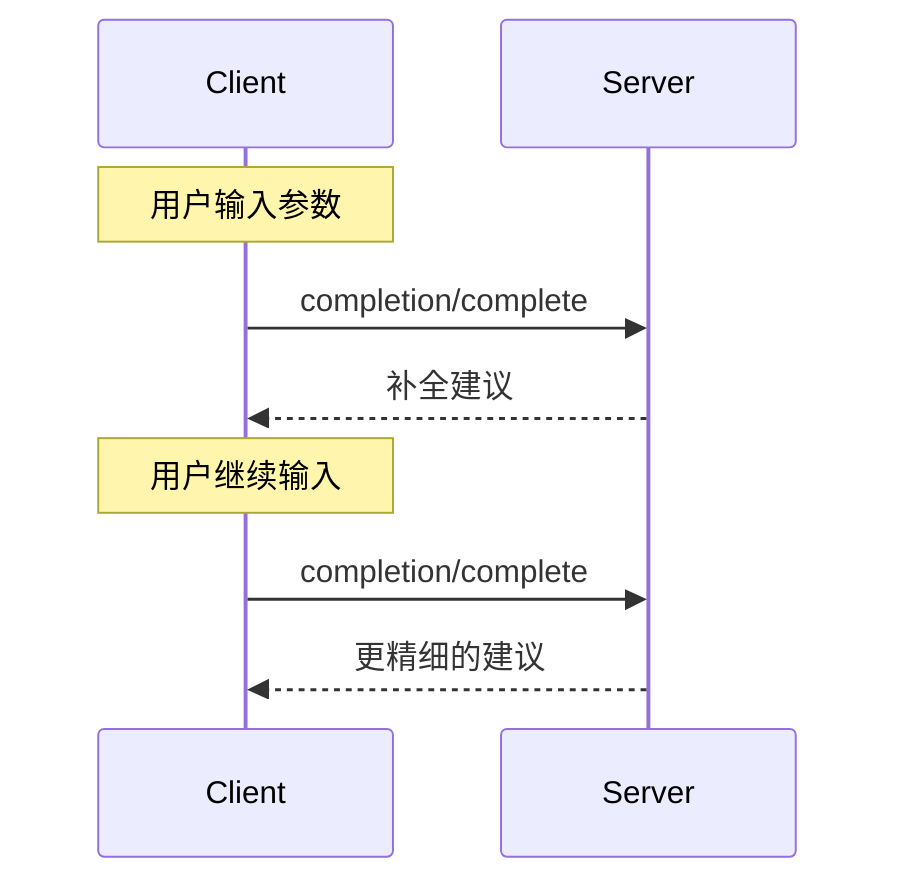

<div id="enable-section-numbers" />

<Info>**协议修订**：草案</Info>

模型上下文协议（MCP）为服务器提供了标准化的方法，用于为提示模板和资源 URI 的参数提供自动补全建议。这样在用户输入参数值时即可获得上下文建议，带来类似 IDE 的丰富体验。

<div id="user-interaction-model">
  ## 用户交互模型
</div>

MCP 中的补全旨在支持类似 IDE 代码补全的交互式用户体验。

例如，应用可以在用户输入时通过下拉或弹出菜单显示补全建议，并允许用户从可用选项中筛选和选择。

不过，各种实现可以按照自身需求，采用任意界面模式来提供补全功能——协议本身并不强制规定任何特定的用户交互模型。

<div id="capabilities">
  ## 功能
</div>

支持补全的服务器**必须**声明 `completions` 能力：

```json
{
  "capabilities": {
    "completions": {}
  }
}
```

<div id="protocol-messages">
  ## 协议消息
</div>

<div id="requesting-completions">
  ### 请求补全
</div>

要获取补全建议，客户端需发送 `completion/complete` 请求，并通过引用类型指定要补全的对象：

**请求：**

```json
{
  "jsonrpc": "2.0",
  "id": 1,
  "method": "completion/complete",
  "params": {
    "ref": {
      "type": "ref/prompt",
      "name": "code_review"
    },
    "argument": {
      "name": "language",
      "value": "py"
    }
  }
}
```

**响应：**

```json
{
  "jsonrpc": "2.0",
  "id": 1,
  "result": {
    "completion": {
      "values": ["python", "pytorch", "pyside"],
      "total": 10,
      "hasMore": true
    }
  }
}
```

对于包含多个参数的提示模板或 URI 模板，客户端应在 `context.arguments` 对象中包含先前的补全结果，为后续请求提供上下文。

**请求：**

```json
{
  "jsonrpc": "2.0",
  "id": 1,
  "method": "completion/complete",
  "params": {
    "ref": {
      "type": "ref/prompt",
      "name": "code_review"
    },
    "argument": {
      "name": "framework",
      "value": "fla"
    },
    "context": {
      "arguments": {
        "language": "python"
      }
    }
  }
}
```

**响应：**

```json
{
  "jsonrpc": "2.0",
  "id": 1,
  "result": {
    "completion": {
      "values": ["flask"],
      "total": 1,
      "hasMore": false
    }
  }
}
```

<div id="reference-types">
  ### 引用类型
</div>

该协议支持两种补全引用类型：

| 类型           | 描述                   | 示例                                               |
| -------------- | ---------------------- | -------------------------------------------------- |
| `ref/prompt`   | 按名称引用提示模板     | `{"type": "ref/prompt", "name": "code_review"}`    |
| `ref/resource` | 按 URI 引用资源        | `{"type": "ref/resource", "uri": "file:///{path}"}` |

<div id="completion-results">
  ### 补全结果
</div>

服务器按相关性返回一个补全值数组，包括：

- 每个响应最多 100 个项
- 可选的可用匹配总数
- 指示是否还有更多结果的布尔值

<div id="message-flow">
  ## 消息流
</div>



<div id="data-types">
  ## 数据类型
</div>

<div id="completerequest">
  ### CompleteRequest
</div>

- `ref`: 一个 `PromptReference` 或 `ResourceReference`
- `argument`: 对象，包含：
  - `name`: 参数名
  - `value`: 当前值
- `context`: 对象，包含：
  - `arguments`: 已解析参数名到其值的映射。

<div id="completeresult">
  ### CompleteResult
</div>

- `completion`: 包含以下内容的对象：
  - `values`: 建议项数组（最多 100 项）
  - `total`: 匹配总数（可选）
  - `hasMore`: 是否有更多结果的标记

<div id="error-handling">
  ## 错误处理
</div>

服务器**应**在常见失败情况下返回标准 JSON-RPC 错误：

- 方法未找到：`-32601`（不支持的能力）
- 无效的提示模板名称：`-32602`（参数无效）
- 缺少必需参数：`-32602`（参数无效）
- 内部错误：`-32603`（内部错误）

<div id="implementation-considerations">
  ## 实现注意事项
</div>

1. 服务器端**应当**：
   - 按相关性排序返回建议
   - 在合适场景实现模糊匹配
   - 对补全请求进行限流
   - 校验所有输入

2. 客户端**应当**：
   - 对频繁的补全请求进行防抖
   - 在合适场景缓存补全结果
   - 优雅地处理缺失或部分结果

<div id="security">
  ## 安全
</div>

实现**必须**：

- 验证所有补全输入
- 实施适当的速率限制
- 控制对敏感建议的访问
- 防止基于补全的信息泄露